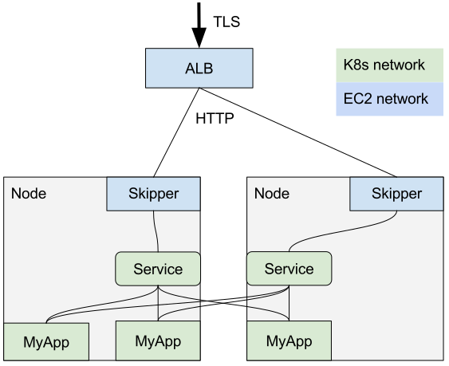
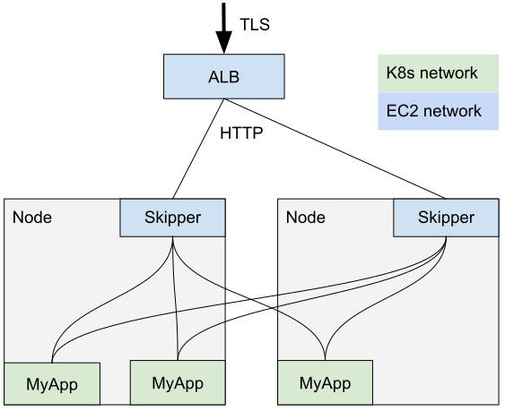
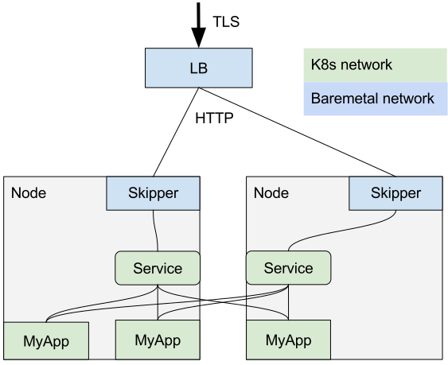
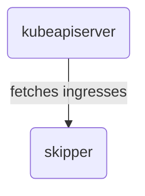
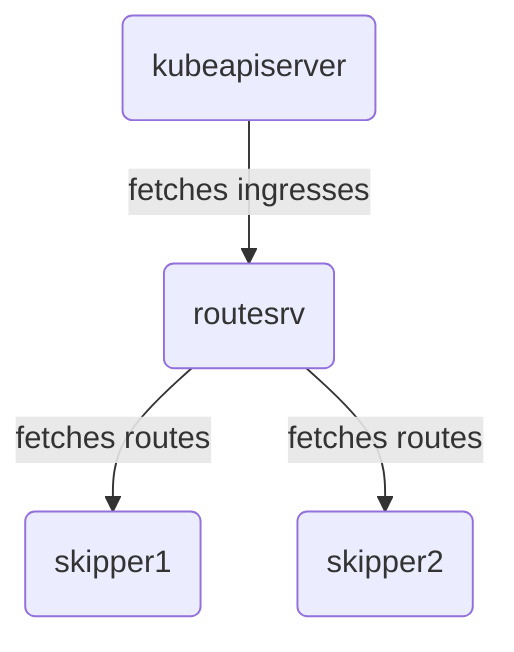

# Skipper Ingress Controller

This documentation is meant for cluster operators and describes
how to install Skipper as Ingress-Controller in your Kubernetes
Cluster.

## Why you should use Skipper as ingress controller?

Baremetal load balancers perform really well, but their configuration is
not updated frequently and most of the installations are not meant
for rapid change. With the introduction of Kubernetes this assumption is
no longer valid and there was a need for a HTTP router which supported
backend routes which changed very frequently. Skipper was initially designed
for a rapidly changing routing tree and subsequently used to implement
an ingress controller in Kubernetes.

Cloud load balancers scale well and can be updated frequently, but do not
provide many features. Skipper has advanced resiliency and deployment
features, which you can use to enhance your environment. For example,
ratelimiters, circuitbreakers, blue-green deployments, shadow traffic
and more -- see [Skipper Ingress Usage](ingress-usage.md).

### Comparison with other Ingress Controllers

At Zalando we chose to run [`kube-ingress-aws-controller`](https://github.com/zalando-incubator/kube-ingress-aws-controller)
with [`skipper ingress`](https://opensource.zalando.com/skipper/kubernetes/ingress-controller/)
as the target group. While AWS load balancers give us features
like TLS termination, automated certificate rotation, possible [WAF](https://aws.amazon.com/waf/),
and [Security Groups](https://docs.aws.amazon.com/vpc/latest/userguide/VPC_SecurityGroups.html),
the HTTP routing capabilities are very limited. Skipper's main advantage
compared to other HTTP routers is matching and changing HTTP. Another advantage
for us and for skipper users in general is that defaults with
[kube-ingress-aws-controller](https://github.com/zalando-incubator/kube-ingress-aws-controller)
just work as you would expect.
For lower latency, safety, and cost reasons you can also use Network
Load Balancer (NLB) instead of Application Load Balancer (ALB).
We tested two cases (Skipper backends were pre-scaled and not changed):

1. A hard switch to a cold NLB with 1 million requests per second
(RPS). A similar test with 100k RPS with ALB results in client visible
error rates and high latency percentiles.
2. A 6h test with 2k RPS showed regular spikes in p999 latency to more
than 100ms in for ALB. NLB showed a flat p999 latency of 25-35ms for
the same workload.

There are a number of other ingress controllers including
[traefik](https://traefik.io/),
[nginx](https://kubernetes.github.io/ingress-nginx/),
[haproxy](https://github.com/jcmoraisjr/haproxy-ingress) or
[aws-alb-ingress-controller](https://github.com/kubernetes-sigs/aws-alb-ingress-controller).
Why not one of these?

[HAproxy](http://www.haproxy.org/) and [Nginx](https://www.nginx.com/) are well understood and
good TCP/HTTP proxies, that were built before Kubernetes. As a result, the first drawback is
their reliance on static configuration files which comes from a time when routes and their
configurations were relatively static. Secondly, the list of annotations to implement even
basic features are already quite a big list for users. Skipper was built to support dynamically
changing route configurations, which happens quite often in Kubernetes. Other advantage of
using Skipper is that we are able to easily implement automated canary deployments,
[automated blue-green deployments](https://github.com/zalando-incubator/stackset-controller)
or [shadow traffic](https://opensource.zalando.com/skipper/kubernetes/ingress-usage/#shadow-traffic).

However there are some features that have better support in `aws-alb-ingress-controller`,
`HAproxy` and `nginx`. For instance the [`sendfile()`](https://linux.die.net/man/2/sendfile)
operation. If you need to stream a large file or large amount of files, then you may want to
go for one of these options.

`aws-alb-ingress-controller` directly routes traffic to your Kubernetes services, which is
both good and bad, because it can reduce latency, but comes with the risk of depending on
kube-proxy routing. `kube-proxy` routing can take up to 30 seconds, ETCD ttl, for finding
pods from dead nodes. In Skipper we passively observe errors from endpoints and are able to
drop these from the load balancer members. We add these to an actively checked member pool,
which will enable endpoints if these are healthy again from skipper's point of view.
Additionally the `aws-alb-ingress-controller` does not support features like ALB sharing,
or [Server Name Indication](https://tools.ietf.org/html/rfc6066#section-3) which can reduce
costs. Features like [path rewriting](https://opensource.zalando.com/skipper/kubernetes/ingress-usage/#modify-path)
are also not currently supported.

`Traefik` has a good community and support for Kubernetes. Skipper originates from
[Project Mosaic](https://www.mosaic9.org/) which was started in 2015. Back then Traefik
was not yet a mature project and still had time to go before the v1.0.0 release.
Traefik also does not currently support our [OpenTracing](https://opentracing.io/) provider.
It also did not support traffic splitting when we started [stackset-controller](https://github.com/zalando-incubator/stackset-controller)
for automated traffic switching. We have also recently done significant work on running
Skipper as API gateway within Kubernetes, which could potentially help many teams that
run many small services on Kubernetes. Skipper predicates and filters are a powerful
abstraction which can enhance the system easily.

### Comparison with service mesh

Why run Skipper and not [Istio](https://istio.io/), [Linkerd](https://linkerd.io/) or other
service-mesh solutions?

Skipper has a Kubernetes native integration, which is reliable, proven in production since
end of 2015 as of March 2019 run in 112 Kubernetes clusters at Zalando. Skipper already has
most of the features provided
by service meshes:

- [Authentication/Authorization](https://opensource.zalando.com/skipper/tutorials/auth/) in
[Kubernetes ingress](https://opensource.zalando.com/skipper/kubernetes/ingress-usage/#authorization),
and can also integrate a custom service with [webhook](https://opensource.zalando.com/skipper/reference/filters/#webhook)
- [Diagnosis tools](https://opensource.zalando.com/skipper/kubernetes/ingress-usage/#diagnosis-throttling-bandwidth-latency)
that support latency, bandwidth throttling, random content and more.
- [Rich Metrics](https://opensource.zalando.com/skipper/operation/operation/#monitoring) which
 you can enable and disable in the Prometheus format.
- [Support for different Opentracing providers](https://opensource.zalando.com/skipper/tutorials/development/#opentracing)
including jaeger, lightstep and instana
- [Ratelimits support](https://opensource.zalando.com/skipper/tutorials/ratelimit/)
with cluster ratelimits as a pending solution, which enables you to stop login attacks easily
- Connects to endpoints directly, instead of using Kubernetes services
- Retries requests, if the request can be safely retried, which is only the case if the error
happens on the TCP/IP connection establishment or a backend whose requests are defined as
idempotent.
- Simple [East-West Communication](https://opensource.zalando.com/skipper/kubernetes/east-west-usage/)
which enables proper communication paths without the need of yet another tool to do service
discovery. See how to [run skipper as API Gateway with East-West setup](https://opensource.zalando.com/skipper/kubernetes/ingress-controller/#run-as-api-gateway-with-east-west-setup),
if you want to run this powerful setup. Kubernetes, Skipper and DNS are the service discovery
in this case.
- [Blue-green deployments](https://opensource.zalando.com/skipper/kubernetes/ingress-usage/#blue-green-deployments)
 with automation if you like to use [stackset-controller](https://github.com/zalando-incubator/stackset-controller)
- [shadow-traffic](https://opensource.zalando.com/skipper/kubernetes/ingress-usage/#shadow-traffic)
 to determine if the new version is able to handle the traffic the same as the old one
- A simple way to do [A/B tests](https://opensource.zalando.com/skipper/kubernetes/ingress-usage/#ab-test)
- You are free to use cloud providers TLS terminations and certificate rotation, which is
reliable and secure. Employees cannot download private keys and certificates are certified
by a public CA. Many mTLS setups rely on insecure CA handling and are hard to debug in case of
 failure.
- We are happy to receive issues and pull requests in our repository, but if you need a feature
which can not be implemented upstream, you are also free to use skipper as a library and
create internal features to do whatever you want.

With Skipper you do not need to choose to go all-in and you are able to add features as soon
as you need or are comfortable.

## What is an Ingress-Controller?

Ingress-controllers are serving http requests into a Kubernetes
cluster. Most of the time traffic will pass through ingress and go to the
Kubernetes endpoints of the respective pods.
For having a successful ingress, you need to have a DNS name pointing
to a set of stable IP addresses that act as a load balancer.

Skipper as ingress-controller:

* cloud: deploy behind the cloud load balancer
* baremetal: deploy behind your hardware/software load balancer and have all skipper as members in one pool.

You would point your DNS entries to the
load balancer in front of skipper, for example automated using
[external-dns](https://github.com/kubernetes-incubator/external-dns).

## Why Skipper uses EndpointSlices or Endpoints and not Services?

Skipper does not use the ClusterIP of [Kubernetes
Services](http://kubernetes.io/docs/user-guide/services) to route
traffic to the pods. Instead it uses the Endpointslices or Endpoints
API to bypass kube-proxy created iptables to remove overhead like
conntrack entries for iptables DNAT. Skipper can also reuse
connections to Pods, such that you have no overhead in establishing
connections all the time. To prevent errors on node failures, Skipper
also does automatic retries to another endpoint in case it gets a
connection refused or TLS handshake error to the endpoint.  Other
reasons are future support of features like session affinity,
different load balancer algorithms or distributed loadbalancing also
known as service mesh.

### Using EndpointSlices instead of Endpoints

[EndpointSlices](https://kubernetes.io/docs/concepts/services-networking/endpoint-slices)
provide the ability to
[scale beyond 1000](https://kubernetes.io/docs/concepts/services-networking/service/#over-capacity-endpoints)
load balancer members in one pool.

To enable EndpointSlices you need to run skipper or routesrv with
`-enable-kubernetes-endpointslices=true`.

### Using Services instead of Endpoints

While using Endpoints is the preferred way of using Skipper as an
ingress controller as described in the section above, there might be
edge cases that require the use of [Kubernetes
Services](http://kubernetes.io/docs/user-guide/services) instead.

An example of scenario where you might need to use Services is when you rely
on Istio networking features to connect multiple clusters, as the IPs of
Kubernetes Endpoints will not resolve in all cases.

If you find yourself in this category, you can override the default behaviour
by setting the `KubernetesForceService` flag to `true` in the `Skipper.Options` struct.
This will cause Skipper to create routes with `BackendType=eskip.NetworkBackend` instead
of `BackendType=eskip.LBBackend` and use the following address format:
`http://<service name>.<namespace>.svc.cluster.local:<port>`. See the [Kubernetes Service DNS
documentation](https://kubernetes.io/docs/concepts/services-networking/dns-pod-service/#services)
for more information.

## AWS deployment

In AWS, this could be an ALB with DNS pointing to the ALB. The ALB can
then point to an ingress-controller running on an EC2 node and uses
Kubernetes `hostnetwork` port specification in the Pod spec.

A logical overview of the traffic flow in AWS is shown in this picture:



We described that Skipper bypasses Kubernetes Service and uses directly
endpoints for [good reasons](https://opensource.zalando.com/skipper/kubernetes/ingress-controller/#why-skipper-uses-endpoints-and-not-services),
therefore the real traffic flow is shown in the next picture.


## Baremetal deployment

In datacenter, baremetal environments, you probably have a hardware
load balancer or some haproxy or nginx setup, that serves most of your
production traffic and DNS points to these endpoints. For example
`*.ingress.example.com` could point to your virtual server IPs in front
of ingress. Skippers could be used as pool members, which do the http
routing. Your load balancer of choice could have a wildcard certificate
for `*.ingress.example.com` and DNS for this would point to your
load balancer. You can also automate DNS records with
[external-dns](https://github.com/kubernetes-incubator/external-dns),
if you for example use PowerDNS as provider and have a load balancer
controller that modifies the status field in ingress to your
load balancer virtual IP.



## RouteSRV

In kubernetes skipper-ingress fetches ingress/routegroup configurations every **3s**, with high number of skipper pods *~100* we faced issues with kube-apiserver. At which we introduced RouteSRV, which will serve as a layer between kube-apiserver and skipper ingress, so it will give us more flexiability in scaling skipper-ingress without affecting k8s-apiserver

### Kubernetes dataclient as routes source




### Kubernetes with RouteSRV as routes source




## Requirements

In general for one endpoint you need, a DNS A/AAAA record pointing to
one or more load balancer IPs. Skipper is best used behind this
layer 4 load balancer to route and manipulate HTTP data.

minimal example:

* layer 4 load balancer has `1.2.3.4:80` as socket for a virtual server pointing to all skipper ingress
* `*.ingress.example.com` points to 1.2.3.4
* ingress object with host entry for `myapp.ingress.example.com` targets a service type ClusterIP
* service type ClusterIP has a selector that targets your Pods of your myapp deployment

TLS example:

* same as before, but you would terminate TLS on your layer 4 load balancer
* layer 4 load balancer has `1.2.3.4:443` as socket for a virtual server
* you can use an automated redirect for all port 80 requests to https with `-kubernetes-https-redirect`
and change the default redirect code with `-kubernetes-https-redirect-code`

## Install Skipper as ingress-controller

You should have a base understanding of [Kubernetes](https://kubernetes.io) and
[Ingress](https://kubernetes.io/docs/concepts/services-networking/ingress/).

Prerequisites:

1. You should checkout the git repository to have access to the
manifests: `git clone https://github.com/zalando/skipper.git`
1. You should enter the cloned directory: `cd skipper`
1. You have to choose how to install skipper-ingress. You can install
it as [daemonset](#daemonset) or as [deployment](#deployment).

Beware, in order to get traffic from the internet, we would need to
have a load balancer in front to direct all traffic to skipper. Skipper
will route the traffic based on ingress objects. The load balancer
should have a HTTP health check, that does a GET request to
`/kube-system/healthz` on all Kubernetes worker nodes. This method is
simple and used successfully in production. In AWS you can run
[`kube-ingress-aws-controller`](https://github.com/zalando-incubator/kube-ingress-aws-controller)
to create these load balancers automatically based on the ingress
definition.

### Deployment style

Follow the deployment style you like: [daemonset](#daemonset) or [deployment](#deployment).

#### Daemonset

We start to deploy skipper-ingress as a daemonset, use hostNetwork and
expose the TCP port 9999 on each Kubernetes worker node for incoming ingress
traffic.

To deploy all manifests required for the daemonset style, you can
run:

```bash
kubectl create -f docs/kubernetes/deploy/daemonset
```

```yaml
# cat docs/kubernetes/deploy/daemonset/daemonset.yaml
{!kubernetes/deploy/daemonset/daemonset.yaml!}
```

Please check, that you are using the [latest
release](https://github.com/zalando/skipper/releases/latest), and do
not use **latest** tag in production. While skipper is quite stable as
library and proxy, there is ongoing development to make skipper more
safe, increase visibility, fix issues that lead to incidents and add
features.

#### Deployment

We start to deploy skipper-ingress as a deployment with an HPA, use
hostNetwork and expose the TCP port 9999 on each Kubernetes worker
node for incoming ingress traffic.

To deploy all manifests required for the deployment style, you can
run:

```bash
kubectl create -f docs/kubernetes/deploy/deployment
```

Now, let's see what we have just deployed.
This will create serviceaccount, PodSecurityPolicy and RBAC rules such that
skipper-ingress is allowed to listen on the hostnetwork and poll
ingress resources.

```yaml
# cat docs/kubernetes/deploy/deployment/rbac.yaml
{!kubernetes/deploy/deployment/rbac.yaml!}
```

The next file creates deployment with all options passed to
skipper, that you should care in a basic production setup.

```yaml
# cat docs/kubernetes/deploy/deployment/deployment.yaml
{!kubernetes/deploy/deployment/deployment.yaml!}
```

This will deploy a HorizontalPodAutoscaler to scale skipper-ingress
based on load.

```yaml
# cat docs/kubernetes/deploy/deployment/hpa.yaml
{!kubernetes/deploy/deployment/hpa.yaml!}
```

The next file will group skipper-ingress with a service, such that internal
clients can access skipper via Kubernetes service.

```yaml
# cat docs/kubernetes/deploy/deployment/service.yaml
{!kubernetes/deploy/deployment/service.yaml!}
```

## Test your skipper setup

We now deploy a simple demo application serving html:

```yaml
# cat docs/kubernetes/deploy/demo/deployment.yaml
{!kubernetes/deploy/demo/deployment.yaml!}
```

We deploy a service type ClusterIP that we will select from ingress:

```yaml
# cat docs/kubernetes/deploy/demo/svc.yaml
{!kubernetes/deploy/demo/svc.yaml!}
```

To deploy the demo application, you have to run:

```bash
kubectl create -f docs/kubernetes/deploy/demo/
```

Now we have a skipper-ingress running as daemonset or deployment
exposing the TCP port 9999 on each worker nodes, which has a running
skipper-ingress instance, a backend application running with 2
replicas that serves some html on TCP port 9090, and we expose a
cluster service on TCP port 80. Besides skipper-ingress, deployment
and service can not be reached from outside the cluster. Now we expose
the application with Ingress to the external network:

```yaml
# cat demo-ing.yaml
apiVersion: networking.k8s.io/v1
kind: Ingress
metadata:
  name: skipper-demo
spec:
  rules:
  - host: skipper-demo.<mydomain.org>
    http:
      paths:
      - backend:
          service:
            name: skipper-demo
            port:
              number: 80
        pathType: ImplementationSpecific
```

To deploy this ingress, you have to run:

```bash
kubectl create -f demo-ing.yaml
```

Skipper will configure itself for the given ingress, such that you can test doing:

```bash
curl -v -H"Host: skipper-demo.<mydomain.org>" http://<nodeip>:9999/
```

The next question you may ask is: how to expose this to your customers?

The answer depends on your setup and complexity requirements. In the
simplest case you could add one A record in your DNS `*.<mydomain.org>`
to your frontend load balancer IP that directs all traffic from `*.<mydomain.org>`
to all Kubernetes worker nodes on TCP port 9999. The load balancer
health check should make sure, that only nodes with ready skipper-ingress
instances will get traffic.

A more complex setup we use in production and can be done with
something that configures your frontend load balancer, for example
[kube-aws-ingress-controller](https://github.com/zalando-incubator/kube-ingress-aws-controller),
and your DNS, [external-dns](https://github.com/kubernetes-incubator/external-dns)
automatically.

## Multiple skipper deployments

If you want to split for example `internal` and `public` traffic, it
might be a good choice to split your ingress deployments. Skipper has
the flag `--kubernetes-ingress-class=<regexp>` to only select ingress
objects that have the annotation `kubernetes.io/ingress.class` set to
something that is matched by `<regexp>`. Skipper will only create
routes for ingress objects with it's annotation or ingress objects
that do not have this annotation.

The default ingress class is `skipper`, if not set. You have to create
your ingress objects with the annotation
`kubernetes.io/ingress.class: skipper` to make sure only skipper will
serve the traffic.

Example ingress:

```yaml
apiVersion: networking.k8s.io/v1
kind: Ingress
metadata:
  annotations:
    kubernetes.io/ingress.class: skipper
  name: app
spec:
  rules:
  - host: app-default.example.org
    http:
      paths:
      - backend:
          service:
            name: app-svc
            port:
              number: 80
        pathType: ImplementationSpecific
```

## Scoping Skipper Deployments to a Single Namespace

In some instances you might want skipper to only watch for ingress objects
created in a single namespace. This can be achieved by using
`kubernetes-namespace=<string>` where `<string>` is the Kubernetes namespace.
Specifying this option forces Skipper to look at the namespace ingresses
endpoint rather than the cluster-wide ingresses endpoint.

By default this value is an empty string (`""`) and will scope the skipper
instance to be cluster-wide, watching all `Ingress` objects across all namespaces.

## Helm-based deployment

[Helm](https://helm.sh/) calls itself the package manager for Kubernetes and therefore take cares of the deployment of whole applications including resources like services, configurations and so on.

Skipper is also available as community contributed Helm chart in the public [quay.io](https://quay.io/repository/) registry.
The latest packaged release can be found [here](https://quay.io/application/baez/skipper).
The source code is available at [GitHub](https://github.com/baez90/skipper-helm).

The chart includes resource definitions for the following use cases:

- RBAC
- [Prometheus-Operator](https://github.com/prometheus-operator/prometheus-operator)

As this chart is not maintained by the Skipper developers and is still under development only the basic deployment workflow is covered here.
Check the GitHub repository for all details.

To be able to deploy the chart you will need the following components:

- `helm` CLI (Install guide [here](https://github.com/kubernetes/helm))
- Helm registry plugin (available [here](https://github.com/app-registry/appr-helm-plugin))

If your environment is setup correctly you should be able to run `helm version --client` and `helm registry version quay.io` and get some information about your tooling without any error.

It is possible to deploy the chart without any further configuration like this:

    helm registry upgrade quay.io/baez/skipper -- \
        --install \
        --wait \
        "your release name e.g. skipper"

The `--wait` switch can be omitted as it only takes care that Helm is waiting until the chart is completely deployed (meaning all resources are created).

To update the deployment to a newer version the same command can be used.

If you have RBAC enabled in your Kubernetes instance you don't have to create all the previously described resources on your own but you can let Helm create them by simply adding one more switch:

    helm registry upgrade quay.io/baez/skipper -- \
        --install \
        --wait \
        --set rbac.create=true \
        "your release name e.g. skipper"

There are some more options available for customization of the chart.
Check the repository if you need more configuration possibilities.

## Run as API Gateway with East-West setup

East-West means cluster internal service-to-service communication.
For this you need to resolve DNS to skipper for one or more additional
domains of your choice. When Ingress or
[RouteGroup](routegroups.md) objects specify such domains Skipper
will add the configured predicates.

### Skipper

To enable the East-West in skipper, you need to run skipper with
`-kubernetes-east-west-range-domains` and
`-kubernetes-east-west-range-predicates` configuration flags. Check the
[East West Range](../tutorials/operations.md#east-west-range) feature.
Skipper will analyze all routes from Kubernetes objects and, the
identified East-West routes will have the predicates specified appended.

For example, for running skipper with the `skipper.cluster.local`
domain, and setting East-West routes to accept just internal traffic,
use the following config:

```
skipper \
  -kubernetes-east-west-range-domains="skipper.cluster.local" \
  -kubernetes-east-west-range-predicates='ClientIP("10.2.0.0/16")'
```

It assumes 10.2.0.0/16 is your PODs' CIDR, you have to change it
accordingly to your environment.

You need also to have a kubernetes service type ClusterIP and write
down the IP (p.e. `10.3.11.28`), which you will need in CoreDNS setup.

### CoreDNS

You can create the DNS records with the `template` plugin from CoreDNS.

Corefile example:
```
.:53 {
    errors
    health
    kubernetes cluster.local in-addr.arpa ip6.arpa {
        pods insecure
        upstream
        fallthrough in-addr.arpa ip6.arpa
    }
    template IN A skipper.cluster.local  {
      match "^.*[.]skipper[.]cluster[.]local"
      answer "{{ .Name }} 60 IN A 10.3.11.28"
      fallthrough
    }
    prometheus :9153
    proxy . /etc/resolv.conf
    cache 30
    reload
}
```


### Usage

If the setup is correct, skipper will protect the following ingress
example with the `ClientIP` predicate:

```yaml
apiVersion: networking.k8s.io/v1
kind: Ingress
metadata:
  name: demo
  namespace: default
spec:
  rules:
  - host: demo.skipper.cluster.local
    http:
      paths:
      - backend:
          service:
            name: example
            port:
              number: 80
        pathType: ImplementationSpecific
```

Your clients inside the cluster should call this example with
`demo.skipper.cluster.local` in their host header. Example
from inside a container:

```sh
curl demo.skipper.cluster.local
```

Skipper won't accept traffic from any IP outside of the configured
network CIDR.

!!! note
    Depending on your environment, you might want to allow traffic not
    just from the PODs' CIDR, but, also, from your nodes' CIDR. When doing
    so, pay attention to do not allow traffic from your LoadBalancer
    and, by consequence, external traffic. You can use different
    combinations of predicates like `ClientIP` and `SourceFromLast` to
    achieve the desired protection.

## Running with Cluster Ratelimits

Cluster ratelimits require a communication exchange method to build a
skipper swarm to have a shared knowledge about the requests passing
all skipper instances. To enable this feature you need to add command
line option `-enable-swarm` and `-enable-ratelimits`.
The rest depends on the implementation, that can be:

- [Redis](https://redis.io)
- alpha version: [SWIM](https://www.cs.cornell.edu/projects/Quicksilver/public_pdfs/SWIM.pdf)

### Redis based

Additionally you have to add `-swarm-redis-urls` to skipper
`args:`. For example: `-swarm-redis-urls=skipper-redis-0.skipper-redis.kube-system.svc.cluster.local:6379,skipper-redis-1.skipper-redis.kube-system.svc.cluster.local:6379`.

Running skipper with `hostNetwork` in kubernetes will not be able to
resolve redis hostnames as shown in the example, if skipper does not
have `dnsPolicy: ClusterFirstWithHostNet` in it's Pod spec, see also
[DNS policy in the official Kubernetes documentation](https://kubernetes.io/docs/concepts/services-networking/dns-pod-service/#pod-s-dns-policy).

This setup is considered experimental and should be carefully tested
before running it in production.

Example redis statefulset with headless service:

```yaml
apiVersion: apps/v1
kind: StatefulSet
metadata:
  labels:
    application: skipper-redis
    version: v6.2.4
  name: skipper-redis
  namespace: kube-system
spec:
  replicas: 2
  selector:
    matchLabels:
      application: skipper-redis
  serviceName: skipper-redis
  template:
    metadata:
      labels:
        application: skipper-redis
        version: v6.2.4
    spec:
      containers:
      - image: registry.opensource.zalan.do/library/redis-6-alpine:6-alpine-20210712
        name: skipper-redis
        ports:
        - containerPort: 6379
          protocol: TCP
        readinessProbe:
          exec:
            command:
            - redis-cli
            - ping
          failureThreshold: 3
          initialDelaySeconds: 10
          periodSeconds: 60
          successThreshold: 1
          timeoutSeconds: 1
        resources:
          limits:
            cpu: 100m
            memory: 100Mi
      dnsPolicy: ClusterFirst
      restartPolicy: Always
      schedulerName: default-scheduler
---
apiVersion: v1
kind: Service
metadata:
  labels:
    application: skipper-redis
  name: skipper-redis
  namespace: kube-system
spec:
  clusterIP: None
  ports:
  - port: 6379
    protocol: TCP
    targetPort: 6379
  selector:
    application: skipper-redis
  type: ClusterIP
```


### SWIM based

[SWIM](https://www.cs.cornell.edu/projects/Quicksilver/public_pdfs/SWIM.pdf)
is a "Scalable Weakly-consistent Infection-style Process Group
Membership Protocol", which is very interesting for example to use for
cluster ratelimits. This setup is not considered stable enough to run
production, yet.

Additionally you have to add the following command line flags to
skipper's container spec `args:`:

```sh
-swarm-port=9990
-swarm-label-selector-key=application
-swarm-label-selector-value=skipper-ingress
-swarm-leave-timeout=5s
-swarm-max-msg-buffer=4194304
-swarm-namespace=kube-system
```

and open another port in Kubernetes and your Firewall settings to make
the communication work with TCP and UDP to the specified `swarm-port`:

```yaml
- containerPort: 9990
  hostPort: 9990
  name: swarm-port
  protocol: TCP
```

## Upgrades

Please always read the announcements of the vX.Y.**0**
[release page](https://github.com/zalando/skipper/releases/tag/v0.19.0),
because these will document in case we break something in a backwards non
compatible way. Most of the time it will be safe to deploy minor
version updates, but better to know in advance if something could
break.

### <v0.14.0 to >=v0.14.0

Kubernetes dataclient removes support for ingress v1beta1.
What does it mean for you?

1. If you run with enabled `-kubernetes-ingress-v1`, you won't need to
  do anything and you can safely delete the flag while updating to
  `>=0.14.0`.
2. If you use skipper as library and pass `KubernetesIngressV1: true`
  via `kubernetes.Options` into `kubernetes.New()`, then you won't need to
  do anything and you can safely delete passing the option while updating to
  `>=0.14.0`.
3. If you use Ingress v1beta1 and run Kubernetes cluster version that
  does not support ingress v1, then you can't update skipper to
  `>=0.14.0`, before you upgrade your Kubernetes cluster.
4. If you use Ingress v1beta1 and run Kubernetes cluster version that
  support ingress v1, then you need to allow skipper to access the new
  APIs with a changed RBAC. See the guide below.


If you are in case 4., you have to apply a change in your RBAC, please
check the diff or the full rendered file.

Diff view (same for deployment and daemonset):
```diff
diff --git docs/kubernetes/deploy/deployment/rbac.yaml docs/kubernetes/deploy/deployment/rbac.yaml
index 361f3789..c0e448a4 100644
--- docs/kubernetes/deploy/deployment/rbac.yaml
+++ docs/kubernetes/deploy/deployment/rbac.yaml
@@ -37,11 +37,18 @@ metadata:
   name: skipper-ingress
   namespace: kube-system
 ---
-apiVersion: rbac.authorization.k8s.io/v1beta1
+apiVersion: rbac.authorization.k8s.io/v1
 kind: ClusterRole
 metadata:
   name: skipper-ingress
 rules:
+- apiGroups:
+  - networking.k8s.io
+  resources:
+  - ingresses
+  verbs:
+  - get
+  - list
 - apiGroups:
     - extensions
   resources:
@@ -66,7 +73,7 @@ rules:
   - get
   - list
 ---
-apiVersion: rbac.authorization.k8s.io/v1beta1
+apiVersion: rbac.authorization.k8s.io/v1
 kind: ClusterRoleBinding
 metadata:
   name: skipper-ingress
@@ -79,7 +86,7 @@ subjects:
   name: skipper-ingress
   namespace: kube-system
 ---
-apiVersion: rbac.authorization.k8s.io/v1beta1
+apiVersion: rbac.authorization.k8s.io/v1
 kind: RoleBinding
 metadata:
   name: skipper-ingress-hostnetwork-psp
```

Full rendered RBAC files (same for deployment and daemonset):

```yaml
# cat docs/kubernetes/deploy/deployment/rbac.yaml
{!kubernetes/deploy/deployment/rbac.yaml!}
```
