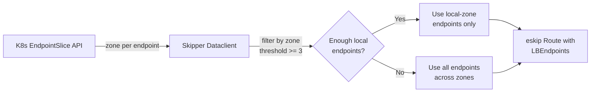
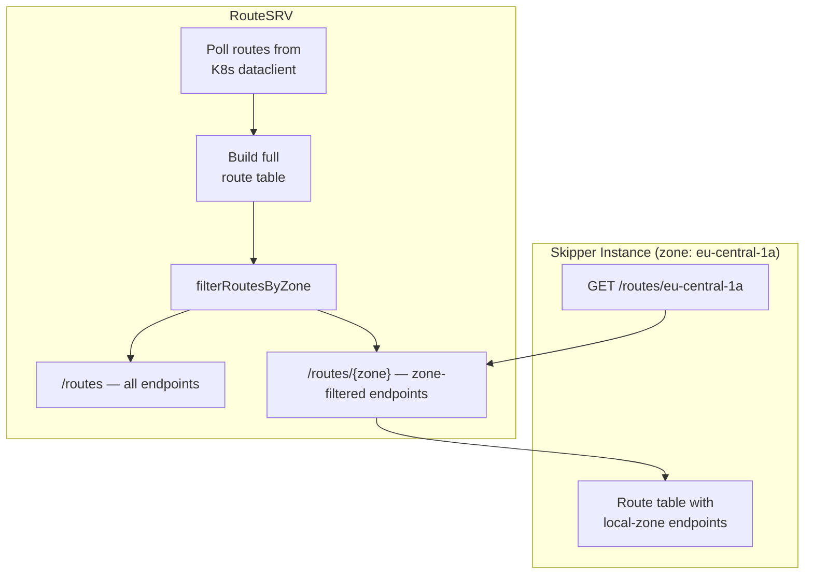

# Zone Aware Routing

Zone aware routing directs traffic preferentially to service endpoints
in the same availability zone as the skipper instance handling the
request. This helps in reducing cross-zone network latency and data transfer
costs in multi-AZ Kubernetes clusters.

This page covers both operator setup (enabling and configuring
zone aware routing) and application-level usage (opting out for
individual resources).

## Prerequisites

Zone aware routing requires:

- **Kubernetes EndpointSlices**: Skipper reads the `zone` field from EndpointSlice endpoints,
  which Kubernetes populates from the node's
  `topology.kubernetes.io/zone` label.

- **Node topology labels**: nodes must have the
  `topology.kubernetes.io/zone` label set. 

- **Skipper configured with `-kubernetes-topology-zone`**: tells
  skipper which zone it is running in. See [Enabling Zone Aware
  Routing](#enabling-zone-aware-routing) below.

## Enabling Zone Aware Routing

How zone aware routing is enabled depends on the deployment mode.

### Dataclient mode (standalone skipper)

Set the `-kubernetes-topology-zone` flag to the availability zone of
the skipper instance:

    -kubernetes-topology-zone string
        sets the topology zone to be used for zone aware routing
        (default: empty, zone aware routing disabled)

When this flag is empty (the default), zone aware routing is disabled
and all endpoints are used regardless of zone.

### RouteSRV mode

Configure skipper instances to fetch routes from RouteSRV using the
zone-specific endpoint by setting `-routes-urls` to include the zone
path:

    -routes-urls http://<routesrv-host>/routes/<zone>

### Injecting the zone via Kubernetes downward API

In a typical deployment, each skipper pod runs on a different node and
should use that node's zone. Use the Kubernetes downward API to inject
the node's topology zone into the pod:

```yaml
apiVersion: apps/v1
kind: Deployment
metadata:
  name: skipper
spec:
  template:
    spec:
      containers:
      - name: skipper
        args:
        - skipper
        - -kubernetes
        - -kubernetes-topology-zone=$(TOPOLOGY_ZONE)
        env:
        - name: TOPOLOGY_ZONE
          valueFrom:
            fieldRef:
              fieldPath: metadata.labels['topology.kubernetes.io/zone']
```

## How It Works

Skipper reads zone information from the Kubernetes EndpointSlice API.
Each endpoint in an EndpointSlice has a `zone` field (for example
`eu-central-1a`) that Kubernetes sets based on the node where the
pod runs.

When zone aware routing is enabled, skipper filters endpoints to
prefer those in the same zone as the skipper instance. A minimum
threshold of **3 endpoints** in the local zone is required for zone
filtering to activate. If fewer than 3 local-zone endpoints exist, all
endpoints across all zones are used as a fallback to maintain
availability.



## Architecture: Two Modes of Zone Filtering

Zone aware routing can operate in two distinct modes, depending on
the deployment model. Both modes apply the same threshold of 3
endpoints per zone.

### Mode 1: Dataclient filtering 

When skipper runs standalone (without RouteSRV), the Kubernetes
dataclient filters endpoints at route build time. When it resolves
backends for an Ingress or RouteGroup, it returns only same-zone
endpoints if at least 3 exist. Otherwise, all endpoints are returned.

This mode is active whenever `-kubernetes-topology-zone` is set.

### Mode 2: RouteSRV filtering

When using a [RouteSRV](ingress-controller.md#routesrv) deployment, RouteSRV
performs zone filtering when serving routes. RouteSRV polls for
routes every 3 seconds, then creates per-zone route variants
by filtering each route's endpoints to the requesting zone.

Skipper instances fetch zone-filtered routes from RouteSRV by
requesting `/routes/{zone}` instead of `/routes`.



## RouteSRV Integration

RouteSRV exposes zone-filtered routes at `/routes/{zone}`.
When a skipper instance requests `/routes/eu-central-1a`, RouteSRV
returns routes with `LBEndpoints` filtered to only those in
`eu-central-1a` (when the threshold is met).

Each zone gets independent HTTP caching metadata:

- **ETag**: zone-specific hash, different from the full-routes ETag
- **X-Count**: number of routes in the zone-filtered set
- **Last-Modified**: timestamp of the last update for that zone

If a requested zone has no data or fewer than 3 endpoints in a
route, RouteSRV falls back to serving the full unfiltered
route set.

## Opting Out

Individual Ingress or RouteGroup resources can opt out of zone aware
routing by setting the `zalando.org/traffic-zone-aware` annotation to
`"false"`. When opted out, traffic is routed to all endpoints
regardless of zone, even if there are at least three local-zone endpoints are available.

### How opt-out works

- When the annotation is set while using the DataClient mode, the DataClient skips zone filtering for that resource's endpoints (all endpoints are included in the route).
- When the annotation is set while using the RouteSRV mode, the filter `annotate("zalando.org/traffic-zone-aware", "false")` is added to the route. This filter signals to RouteSRV that the route should not be zone-filtered when serving `/routes/{zone}`.

## Behavior Details

- **Threshold**: zone filtering activates only when there are at least
  3 endpoints in the local zone. This prevents routing all traffic to
  a very small number of local pods, which could cause overload.

- **Fallback**: when the threshold is not met, all endpoints across
  all zones are used. This ensures availability is maintained even
  when a zone has few or no endpoints.
