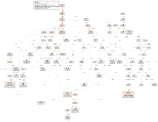

# Operations

This is the work in progress operations guide for showing information,
which are relevant for production use.

Skipper is proven to scale with number of routes beyond 300.000 routes
per instance. In Kubernetes we run beyond 15000 routes in a single
cluster. A single Skipper instance was tested to respond 65.000 http
requests per second in continuous load tests at `<=25ms` p999 in a
production like setup with logs, metrics and tracing enabled. Skipper
regularly runs in production at 2 million requests per second running
multiple instances.

## Connection Options

Skipper's connection options are allowing you to set Go's [http.Server](https://golang.org/pkg/net/http/#Server)
Options on the client side and [http.Transport](https://golang.org/pkg/net/http/#Transport) on the backend side.

It is recommended to read
[this blog post about net http timeouts](https://blog.cloudflare.com/the-complete-guide-to-golang-net-http-timeouts/)
in order to better understand the impact of these settings.

### Backend

Backend is the side skipper opens a client connection to.

Closing idle connections is required for DNS failover, because Go's
[http.Transport](https://golang.org/pkg/net/http/#Transport) caches
DNS lookups and needs to create new connections for doing so. Skipper
will start a goroutine and use the specified
[time.Duration](https://golang.org/pkg/time/#Duration) to call
CloseIdleConnections() on that
[http.Transport](https://golang.org/pkg/net/http/#Transport).

    -close-idle-conns-period string
        period of closing all idle connections in seconds or as a
        duration string. Not closing when less than 0 (default "20")

This will set MaxIdleConnsPerHost on the
[http.Transport](https://golang.org/pkg/net/http/#Transport) to limit
the number of idle connections per backend such that we do not run out
of sockets.

    -idle-conns-num int
        maximum idle connections per backend host (default 64)

This will set MaxIdleConns on the
[http.Transport](https://golang.org/pkg/net/http/#Transport) to limit
the number for all backends such that we do not run out of sockets.

    -disable-http-keepalives bool
        forces backend to always create a new connection

This will set DisableKeepAlives on the
[http.Transport](https://golang.org/pkg/net/http/#Transport) to disable
HTTP keep-alive and to only use the connection for single request.

    -max-idle-connection-backend int
        sets the maximum idle connections for all backend connections

This will set TLSHandshakeTimeout on the
[http.Transport](https://golang.org/pkg/net/http/#Transport) to have
timeouts based on TLS connections.

    -tls-timeout-backend duration
        sets the TLS handshake timeout for backend connections (default 1m0s)

This will set Timeout on
[net.Dialer](https://golang.org/pkg/net/#Dialer) that is the
implementation of DialContext, which is the TCP connection pool used in the
[http.Transport](https://golang.org/pkg/net/http/#Transport).

    -timeout-backend duration
        sets the TCP client connection timeout for backend connections (default 1m0s)

This will set KeepAlive on
[net.Dialer](https://golang.org/pkg/net/#Dialer) that is the
implementation of DialContext, which is the TCP connection pool used in the
[http.Transport](https://golang.org/pkg/net/http/#Transport).

    -keepalive-backend duration
        sets the keepalive for backend connections (default 30s)

This will set DualStack (IPv4 and IPv6) on
[net.Dialer](https://golang.org/pkg/net/#Dialer) that is the
implementation of DialContext, which is the TCP connection pool used in the
[http.Transport](https://golang.org/pkg/net/http/#Transport).

    -enable-dualstack-backend
        enables DualStack for backend connections (default true)


### Client

Client is the side skipper gets incoming calls from.
Here we can set timeouts in different parts of the http connection.

This will set ReadTimeout in
[http.Server](https://golang.org/pkg/net/http/#Server) handling
incoming calls from your clients.

    -read-timeout-server duration
        set ReadTimeout for http server connections (default 5m0s)

This will set ReadHeaderTimeout in
[http.Server](https://golang.org/pkg/net/http/#Server) handling
incoming calls from your clients.

    -read-header-timeout-server duration
        set ReadHeaderTimeout for http server connections (default 1m0s)

This will set WriteTimeout in
[http.Server](https://golang.org/pkg/net/http/#Server) handling
incoming calls from your clients.

    -write-timeout-server duration
        set WriteTimeout for http server connections (default 1m0s)

This will set IdleTimeout in
[http.Server](https://golang.org/pkg/net/http/#Server) handling
incoming calls from your clients. If you have another loadbalancer
layer in front of your Skipper http routers, for example [AWS Application Load
Balancers](https://docs.aws.amazon.com/elasticloadbalancing/latest/application/application-load-balancers.html#connection-idle-timeout),
you should make sure, that Skipper's `idle-timeout-server` setting is
bigger than the idle timeout from the loadbalancer in front. Wrong
combinations of idle timeouts can lead to a few unexpected HTTP 502.

    -idle-timeout-server duration
        maximum idle connections per backend host (default 1m0s)

This configures maximum number of requests served by server connections:

    -keepalive-requests-server int
        sets maximum number of requests for http server connections. The connection is closed after serving this number of requests. Default is 0 for unlimited.

This configures maximum age for server connections:

    -keepalive-server duration
        sets maximum age for http server connections. The connection is closed after it existed for this duration. Default is 0 for unlimited.

This will set MaxHeaderBytes in
[http.Server](https://golang.org/pkg/net/http/#Server) to limit the
size of the http header from your clients.

    -max-header-bytes int
        set MaxHeaderBytes for http server connections (default 1048576)

### TCP LIFO

Skipper implements now controlling the maximum incoming TCP client
connections.

The purpose of the mechanism is to prevent Skipper requesting more memory
than available in case of too many concurrent connections, especially in
an autoscaling deployment setup, in those case when the scaling is not
fast enough to follow sudden connection spikes.

This solution relies on a listener implementation combined with a LIFO
queue. It allows only a limited number of connections being handled
concurrently, defined by the max concurrency configuration. When the max
concurrency limit is reached, the new incoming client connections are
stored in a queue. When an active (accepted) connection is closed, the
most recent pending connection from the queue will be accepted. When the
queue is full, the oldest pending connection is closed and dropped, and the
new one is inserted into the queue.

The feature can be enabled with the `-enable-tcp-queue` flag. The maximum
concurrency can bet set with the `-max-tcp-listener-concurrency` flag, or,
if this flag is not set, then Skipper tries to infer the maximum accepted
concurrency from the system by reading the
/sys/fs/cgroup/memory/memory.limit_in_bytes file. In this case, it uses the
average expected per request memory requirement, which can be set with the
`-expected-bytes-per-request` flag.

Note that the automatically inferred limit may not work as expected in an
environment other than cgroups v1 or cgroups v2.

### OAuth2 Tokeninfo

OAuth2 filters integrate with external services and have their own
connection handling. Outgoing calls to these services have a
default timeout of 2s, which can be changed by the flag
`-oauth2-tokeninfo-timeout=<OAuthTokeninfoTimeout>`.

### OAuth2 Tokenintrospection RFC7662

OAuth2 filters integrate with external services and have their own
connection handling. Outgoing calls to these services have a
default timeout of 2s, which can be changed by the flag
`-oauth2-tokenintrospect-timeout=<OAuthTokenintrospectionTimeout>`.

## Monitoring

Monitoring is one of the most important things you need to run in
production and skipper has a [godoc page](https://pkg.go.dev/github.com/zalando/skipper)
for the [metrics package](https://pkg.go.dev/github.com/zalando/skipper/metrics),
describing options and most keys you will find in the metrics handler
endpoint. The default is listening on `:9911/metrics`. You can modify
the listen port with the `-support-listener` flag. Metrics can exposed
using formats Codahale (json) or Prometheus and be configured by
`-metrics-flavour=`, which defaults to `codahale`. To expose both
formats you can use a comma separated list: `-metrics-flavour=codahale,prometheus`.


### Prometheus

In case you want to get metrics in [Prometheus](https://prometheus.io/) format exposed, use this
option to enable it:

    -metrics-flavour=prometheus

It will return [Prometheus](https://prometheus.io/) metrics on the
common metrics endpoint :9911/metrics.

To monitor skipper we recommend the following queries:

- P99 Proxy latency: `histogram_quantile(0.99, sum(rate(skipper_proxy_total_duration_seconds_bucket{}[1m])) by (le))`
- P99 backend latency: `histogram_quantile(0.99, sum(rate(skipper_serve_host_duration_seconds_bucket{}[1m])) by (le))`
- HTTP 2xx rate: `histogram_quantile(0.99, sum(rate(skipper_serve_host_duration_seconds_bucket{code =~ "2.*"}[1m])) by (le) )`
- HTTP 4xx rate: `histogram_quantile(0.99, sum(rate(skipper_serve_host_duration_seconds_bucket{code =~ "4.*"}[1m])) by (le) )`
- HTTP 5xx rate: `histogram_quantile(0.99, sum(rate(skipper_serve_host_duration_seconds_bucket{code =~ "52.*"}[1m])) by (le) )`
- Max goroutines (depends on label selector): `max(go_goroutines{application="skipper-ingress"})`
- Max threads (depends on label selector): `max(go_threads{application="skipper-ingress"})`
- max heap memory in use in MB (depends on label selector): `max(go_memstats_heap_inuse_bytes{application="skipper-ingress"}) / 1024 / 1000`
- Max number of heap objects (depends on label selector): `max(go_memstats_heap_objects{application="skipper-ingress"})`
- Max of P75 Go GC runtime in ms (depends on label selector): `max(go_gc_duration_seconds{application="skipper-ingress",quantile="0.75"}) * 1000 * 1000`
- P99 request filter duration (depends on label selector): `histogram_quantile(0.99, sum(rate(skipper_filter_request_duration_seconds_bucket{application="skipper-ingress"}[1m])) by (le) )`
- P99 response filter duration (depends on label selector): `histogram_quantile(0.99, sum(rate(skipper_filter_response_duration_seconds_bucket{application="skipper-ingress"}[1m])) by (le) )`
- If you use Kubernetes limits or Linux cgroup CFS quotas (depends on label selector): `sum(rate(container_cpu_cfs_throttled_periods_total{container_name="skipper-ingress"}[1m]))`

You may add static metrics labels like `version` using Prometheus [relabeling feature](https://prometheus.io/docs/prometheus/latest/configuration/configuration/#relabel_config).

### Proxy Metrics

Skipper Proxy Metrics provides information about the time spent by skipper in processing a request i.e., the time spent by a request inside skipper (this excludes the response application of filters to a req/res, the backend roundtrip and serving the response). The total proxy metrics are enabled by default and these metrics can be used to build KPIs / SLOs, so as to understand and monitor the performance of skipper.

The Proxy Metrics excludes the filter processing as this is dependent on which filters the user decides to use for a particular route. The backend round trip time depends on the backend application and the operation being performed. And the serve response depends on the client. These are operations are not in control of skipper and are hence excluded to solely monitor the performance of Skipper.

These metrics are exposed in /metrics, the example json structure looks like this:

```json
{
  "timers" : {
    "skipper.proxy.total": {
      "15m.rate": 0.2,
      "1m.rate": 0.2,
      "5m.rate": 0.2,
      "75%": 288375,
      "95%": 288375,
      "99%": 288375,
      "99.9%": 288375,
      "count": 1,
      "max": 288375,
      "mean": 288375,
      "mean.rate": 0.7268368234069077,
      "median": 288375,
      "min": 288375,
      "stddev": 0
    },
  }
}
```

The proxy metrics can also be fetched in more detail, i.e., splits the proxy total metrics to get the proxy request metrics and proxy response metrics. The Proxy Request Metrics provides the duration / time taken from the start of ServeHTTP till the backend round trip. The Proxy Response Metrics provides the duration / time taken from after the backend round trip till the response is served.

    -proxy-request-metrics
        enables the collection proxy request metrics
    -proxy-response-metrics
        enables the collection proxy response metrics

If enabled these metrics are also exposed in /metrics, and the example json structure would like the following:

```json
{
  "timers": {
    "skipper.proxy.request": {
      "15m.rate": 0.2,
      "1m.rate": 0.2,
      "5m.rate": 0.2,
      "75%": 0,
      "95%": 0,
      "99%": 0,
      "99.9%": 0,
      "count": 1,
      "max": 0,
      "mean": 0,
      "mean.rate": 0.7268396413261223,
      "median": 0,
      "min": 0,
      "stddev": 0
    },
    "skipper.proxy.response": {
      "15m.rate": 0.2,
      "1m.rate": 0.2,
      "5m.rate": 0.2,
      "75%": 288375,
      "95%": 288375,
      "99%": 288375,
      "99.9%": 288375,
      "count": 1,
      "max": 288375,
      "mean": 288375,
      "mean.rate": 0.7268397290232465,
      "median": 288375,
      "min": 288375,
      "stddev": 0
    },
  }
}
```

### Connection metrics

This option will enable known loadbalancer connections metrics, like
counters for active and new connections. This feature sets a metrics
callback on [http.Server](https://golang.org/pkg/net/http/#Server) and
uses a counter to collect
[http.ConnState](https://golang.org/pkg/net/http/#ConnState).

    -enable-connection-metrics
        enables connection metrics for http server connections

It will expose them in /metrics, for example json structure looks like this example:

```json
{
  "counters": {
    "skipper.lb-conn-active": {
      "count": 6
    },
    "skipper.lb-conn-closed": {
      "count": 6
    },
    "skipper.lb-conn-idle": {
      "count": 6
    },
    "skipper.lb-conn-new": {
      "count": 6
    }
  },
  /* stripped a lot of metrics here */
}
```

### LIFO metrics

When enabled in the routes, LIFO queues can control the maximum concurrency level
proxied to the backends and mitigate the impact of traffic spikes. The current
level of concurrency and the size of the queue can be monitored with gauges per
each route using one of the lifo filters. To enable monitoring for the lifo
filters, use the command line option:

    -enable-route-lifo-metrics

When queried, it will return metrics like:

```json
{
  "gauges": {
    "skipper.lifo.routeXYZ.active": {
      "value": 245
    },
    "skipper.lifo.routeXYZ.queued": {
      "value": 27
    }
  }
}
```

### Application metrics

Application metrics for your proxied applications you can enable with the option:

    -serve-host-metrics
        enables reporting total serve time metrics for each host
    -serve-route-metrics
        enables reporting total serve time metrics for each route

This will make sure you will get stats for each "Host" header or the
route name as "timers". The following is an example for
`-serve-host-metrics`:

```json
"timers": {
  "skipper.servehost.app1_example_com.GET.200": {
    "15m.rate": 0.06830666203045982,
    "1m.rate": 2.162612637718806e-06,
    "5m.rate": 0.008312609284452856,
    "75%": 236603815,
    "95%": 236603815,
    "99%": 236603815,
    "99.9%": 236603815,
    "count": 3,
    "max": 236603815,
    "mean": 116515451.66666667,
    "mean.rate": 0.0030589345776699827,
    "median": 91273391,
    "min": 21669149,
    "stddev": 89543653.71950394
  },
  "skipper.servehost.app1_example_com.GET.304": {
    "15m.rate": 0.3503336738177459,
    "1m.rate": 0.07923086447313292,
    "5m.rate": 0.27019839341602214,
    "75%": 99351895.25,
    "95%": 105381847,
    "99%": 105381847,
    "99.9%": 105381847,
    "count": 4,
    "max": 105381847,
    "mean": 47621612,
    "mean.rate": 0.03087161486272533,
    "median": 41676170.5,
    "min": 1752260,
    "stddev": 46489302.203724876
  },
  "skipper.servehost.app1_example_com.GET.401": {
    "15m.rate": 0.16838468990057648,
    "1m.rate": 0.01572861413072501,
    "5m.rate": 0.1194724817779537,
    "75%": 91094832,
    "95%": 91094832,
    "99%": 91094832,
    "99.9%": 91094832,
    "count": 2,
    "max": 91094832,
    "mean": 58090623,
    "mean.rate": 0.012304914018033056,
    "median": 58090623,
    "min": 25086414,
    "stddev": 33004209
  }
},
```

Note you can reduce the dimension of the metrics by removing the HTTP
status code and method from it. Use the `-serve-method-metric=false`
and/or `-serve-status-code-metric=false`. Both flags are enabled by
default. For prometheus metrics flavour, a counter with both the HTTP
method and status code can be enabled with `-serve-host-counter` or
`-serve-route-counter`, even if these flags are disabled.

To change the sampling type of how metrics are handled from
[uniform](https://pkg.go.dev/github.com/rcrowley/go-metrics#UniformSample)
to [exponential decay](https://pkg.go.dev/github.com/rcrowley/go-metrics#ExpDecaySample),
you can use the following option, which is better for not so huge
utilized applications (less than 100 requests per second):

    -metrics-exp-decay-sample
        use exponentially decaying sample in metrics


### Go metrics

Metrics from the
[go runtime memstats](https://golang.org/pkg/runtime/#MemStats)
are exposed from skipper to the metrics endpoint, default listener
:9911, on path /metrics

#### Go metrics - Codahale

```json
"gauges": {
  "skipper.runtime.MemStats.Alloc": {
    "value": 3083680
  },
  "skipper.runtime.MemStats.BuckHashSys": {
    "value": 1452675
  },
  "skipper.runtime.MemStats.DebugGC": {
    "value": 0
  },
  "skipper.runtime.MemStats.EnableGC": {
    "value": 1
  },
  "skipper.runtime.MemStats.Frees": {
    "value": 121
  },
  "skipper.runtime.MemStats.HeapAlloc": {
    "value": 3083680
  },
  "skipper.runtime.MemStats.HeapIdle": {
    "value": 778240
  },
  "skipper.runtime.MemStats.HeapInuse": {
    "value": 4988928
  },
  "skipper.runtime.MemStats.HeapObjects": {
    "value": 24005
  },
  "skipper.runtime.MemStats.HeapReleased": {
    "value": 0
  },
  "skipper.runtime.MemStats.HeapSys": {
    "value": 5767168
  },
  "skipper.runtime.MemStats.LastGC": {
    "value": 1516098381155094500
  },
  "skipper.runtime.MemStats.Lookups": {
    "value": 2
  },
  "skipper.runtime.MemStats.MCacheInuse": {
    "value": 6944
  },
  "skipper.runtime.MemStats.MCacheSys": {
    "value": 16384
  },
  "skipper.runtime.MemStats.MSpanInuse": {
    "value": 77368
  },
  "skipper.runtime.MemStats.MSpanSys": {
    "value": 81920
  },
  "skipper.runtime.MemStats.Mallocs": {
    "value": 1459
  },
  "skipper.runtime.MemStats.NextGC": {
    "value": 4194304
  },
  "skipper.runtime.MemStats.NumGC": {
    "value": 0
  },
  "skipper.runtime.MemStats.PauseTotalNs": {
    "value": 683352
  },
  "skipper.runtime.MemStats.StackInuse": {
    "value": 524288
  },
  "skipper.runtime.MemStats.StackSys": {
    "value": 524288
  },
  "skipper.runtime.MemStats.Sys": {
    "value": 9246968
  },
  "skipper.runtime.MemStats.TotalAlloc": {
    "value": 35127624
  },
  "skipper.runtime.NumCgoCall": {
    "value": 0
  },
  "skipper.runtime.NumGoroutine": {
    "value": 11
  },
  "skipper.runtime.NumThread": {
    "value": 9
  }
},
"histograms": {
  "skipper.runtime.MemStats.PauseNs": {
    "75%": 82509.25,
    "95%": 132609,
    "99%": 132609,
    "99.9%": 132609,
    "count": 12,
    "max": 132609,
    "mean": 56946,
    "median": 39302.5,
    "min": 28749,
    "stddev": 31567.015005117817
  }
}
```

#### Go metrics - Prometheus

```
# HELP go_gc_duration_seconds A summary of the pause duration of garbage collection cycles.
# TYPE go_gc_duration_seconds summary
go_gc_duration_seconds{quantile="0"} 4.7279e-05
go_gc_duration_seconds{quantile="0.25"} 5.9291e-05
go_gc_duration_seconds{quantile="0.5"} 7.4e-05
go_gc_duration_seconds{quantile="0.75"} 9.55e-05
go_gc_duration_seconds{quantile="1"} 0.000199667
go_gc_duration_seconds_sum 0.001108339
go_gc_duration_seconds_count 13
# HELP go_goroutines Number of goroutines that currently exist.
# TYPE go_goroutines gauge
go_goroutines 13
# HELP go_info Information about the Go environment.
# TYPE go_info gauge
go_info{version="go1.21.3"} 1
# HELP go_memstats_alloc_bytes Number of bytes allocated and still in use.
# TYPE go_memstats_alloc_bytes gauge
go_memstats_alloc_bytes 6.4856e+06
# HELP go_memstats_alloc_bytes_total Total number of bytes allocated, even if freed.
# TYPE go_memstats_alloc_bytes_total counter
go_memstats_alloc_bytes_total 4.1797384e+07
# HELP go_memstats_buck_hash_sys_bytes Number of bytes used by the profiling bucket hash table.
# TYPE go_memstats_buck_hash_sys_bytes gauge
go_memstats_buck_hash_sys_bytes 1.462151e+06
# HELP go_memstats_frees_total Total number of frees.
# TYPE go_memstats_frees_total counter
go_memstats_frees_total 507460
# HELP go_memstats_gc_sys_bytes Number of bytes used for garbage collection system metadata.
# TYPE go_memstats_gc_sys_bytes gauge
go_memstats_gc_sys_bytes 4.549296e+06
# HELP go_memstats_heap_alloc_bytes Number of heap bytes allocated and still in use.
# TYPE go_memstats_heap_alloc_bytes gauge
go_memstats_heap_alloc_bytes 6.4856e+06
# HELP go_memstats_heap_idle_bytes Number of heap bytes waiting to be used.
# TYPE go_memstats_heap_idle_bytes gauge
go_memstats_heap_idle_bytes 7.421952e+06
# HELP go_memstats_heap_inuse_bytes Number of heap bytes that are in use.
# TYPE go_memstats_heap_inuse_bytes gauge
go_memstats_heap_inuse_bytes 8.372224e+06
# HELP go_memstats_heap_objects Number of allocated objects.
# TYPE go_memstats_heap_objects gauge
go_memstats_heap_objects 70159
# HELP go_memstats_heap_released_bytes Number of heap bytes released to OS.
# TYPE go_memstats_heap_released_bytes gauge
go_memstats_heap_released_bytes 6.47168e+06
# HELP go_memstats_heap_sys_bytes Number of heap bytes obtained from system.
# TYPE go_memstats_heap_sys_bytes gauge
go_memstats_heap_sys_bytes 1.5794176e+07
# HELP go_memstats_last_gc_time_seconds Number of seconds since 1970 of last garbage collection.
# TYPE go_memstats_last_gc_time_seconds gauge
go_memstats_last_gc_time_seconds 1.6987664839728708e+09
# HELP go_memstats_lookups_total Total number of pointer lookups.
# TYPE go_memstats_lookups_total counter
go_memstats_lookups_total 0
# HELP go_memstats_mallocs_total Total number of mallocs.
# TYPE go_memstats_mallocs_total counter
go_memstats_mallocs_total 577619
# HELP go_memstats_mcache_inuse_bytes Number of bytes in use by mcache structures.
# TYPE go_memstats_mcache_inuse_bytes gauge
go_memstats_mcache_inuse_bytes 19200
# HELP go_memstats_mcache_sys_bytes Number of bytes used for mcache structures obtained from system.
# TYPE go_memstats_mcache_sys_bytes gauge
go_memstats_mcache_sys_bytes 31200
# HELP go_memstats_mspan_inuse_bytes Number of bytes in use by mspan structures.
# TYPE go_memstats_mspan_inuse_bytes gauge
go_memstats_mspan_inuse_bytes 302904
# HELP go_memstats_mspan_sys_bytes Number of bytes used for mspan structures obtained from system.
# TYPE go_memstats_mspan_sys_bytes gauge
go_memstats_mspan_sys_bytes 309624
# HELP go_memstats_next_gc_bytes Number of heap bytes when next garbage collection will take place.
# TYPE go_memstats_next_gc_bytes gauge
go_memstats_next_gc_bytes 8.206808e+06
# HELP go_memstats_other_sys_bytes Number of bytes used for other system allocations.
# TYPE go_memstats_other_sys_bytes gauge
go_memstats_other_sys_bytes 2.402169e+06
# HELP go_memstats_stack_inuse_bytes Number of bytes in use by the stack allocator.
# TYPE go_memstats_stack_inuse_bytes gauge
go_memstats_stack_inuse_bytes 983040
# HELP go_memstats_stack_sys_bytes Number of bytes obtained from system for stack allocator.
# TYPE go_memstats_stack_sys_bytes gauge
go_memstats_stack_sys_bytes 983040
# HELP go_memstats_sys_bytes Number of bytes obtained from system.
# TYPE go_memstats_sys_bytes gauge
go_memstats_sys_bytes 2.5531656e+07
# HELP go_threads Number of OS threads created.
# TYPE go_threads gauge
go_threads 22
# HELP process_cpu_seconds_total Total user and system CPU time spent in seconds.
# TYPE process_cpu_seconds_total counter
process_cpu_seconds_total 0.42
# HELP process_max_fds Maximum number of open file descriptors.
# TYPE process_max_fds gauge
process_max_fds 60000
# HELP process_open_fds Number of open file descriptors.
# TYPE process_open_fds gauge
process_open_fds 10
# HELP process_resident_memory_bytes Resident memory size in bytes.
# TYPE process_resident_memory_bytes gauge
process_resident_memory_bytes 4.2811392e+07
# HELP process_start_time_seconds Start time of the process since unix epoch in seconds.
# TYPE process_start_time_seconds gauge
process_start_time_seconds 1.69876646736e+09
# HELP process_virtual_memory_bytes Virtual memory size in bytes.
# TYPE process_virtual_memory_bytes gauge
process_virtual_memory_bytes 2.823462912e+09
# HELP process_virtual_memory_max_bytes Maximum amount of virtual memory available in bytes.
# TYPE process_virtual_memory_max_bytes gauge
process_virtual_memory_max_bytes 1.8446744073709552e+19
```

### Redis - Rate limiting metrics

System metrics exposed by the redisclient:

- skipper.swarm.redis.shards: known Redis shards to the skipper ringclient
- skipper.swarm.redis.hits: number of times free connection was found in the pool
- skipper.swarm.redis.misses: number of times free connection was NOT found in the pool
- skipper.swarm.redis.timeouts: number of times a wait timeout occurred
- skipper.swarm.redis.staleconns: number of stale connections removed from the pool
- skipper.swarm.redis.idleconns: number of idle connections in the pool
- skipper.swarm.redis.totalconns: number of total connections in the pool

Timer metrics for the latencies and errors of the communication with the auxiliary Redis instances are enabled
by the default, and exposed among the timers via the following keys:

- skipper.swarm.redis.query.allow.success: successful allow requests to the rate limiter, ungrouped
- skipper.swarm.redis.query.allow.failure: failed allow requests to the rate limiter, ungrouped, where the redis
  communication failed
- skipper.swarm.redis.query.retryafter.success.<group>: successful allow requests to the rate limiter, grouped
  by the rate limiter group name when used
- skipper.swarm.redis.query.retryafter.failure.<group>: failed allow requests to the rate limiter, ungrouped,
  where the redis communication failed, grouped by the rate limiter group name when used

See more details about rate limiting at [Rate limiting](../reference/filters.md#clusterclientratelimit).

### Open Policy Agent metrics

If Open Policy Agent filters are enabled, the following counters show up in the `/metrics` endpoint. The bundle-name is the first parameter of the filter so that for example increased error codes can be attributed to a specific source bundle / system.

- `skipper.opaAuthorizeRequest.custom.decision.allow.<bundle-name>`
- `skipper.opaAuthorizeRequest.custom.decision.deny.<bundle-name>`
- `skipper.opaAuthorizeRequest.custom.decision.err.<bundle-name>`
- `skipper.opaServeResponse.custom.decision.allow.<bundle-name>`
- `skipper.opaServeResponse.custom.decision.deny.<bundle-name>`
- `skipper.opaServeResponse.custom.decision.err.<bundle-name>`

The following timer metrics are exposed per used bundle-name:

- `skipper.opaAuthorizeRequest.custom.eval_time.<bundle-name>`
- `skipper.opaServeResponse.custom.eval_time.<bundle-name>`

Open Policy Agent [native Prometheus metrics](https://www.openpolicyagent.org/docs/monitoring#status-metrics) are passed through if the metrics backend is set to Prometheus (via `--metrics-flavour`). 

The OPA native metrics are prefixed with `skipper_openpolicyagent_`, e.g. `skipper_openpolicyagent_plugin_status_gauge` will be exposed via Skipper's `/metrics` endpoint. Two extra labels are added to all metrics: `opa_instance_name` (set to the bundle name parameter of the filters) and `opa_instance_id` (a random ID that identifies the virtual OPA instance).

### RouteSRV metrics

RouteSRV metrics expose the following metrics in Prometheus format:

```
% curl http://127.0.0.1:9911/metrics
# 8< Go metrics >8

# HELP routesrv_backend_combined_duration_seconds Duration in seconds of a proxy backend combined.
# TYPE routesrv_backend_combined_duration_seconds histogram
routesrv_backend_combined_duration_seconds_bucket{le="0.005"} 5
routesrv_backend_combined_duration_seconds_bucket{le="0.01"} 5
routesrv_backend_combined_duration_seconds_bucket{le="0.025"} 5
routesrv_backend_combined_duration_seconds_bucket{le="0.05"} 5
routesrv_backend_combined_duration_seconds_bucket{le="0.1"} 5
routesrv_backend_combined_duration_seconds_bucket{le="0.25"} 5
routesrv_backend_combined_duration_seconds_bucket{le="0.5"} 5
routesrv_backend_combined_duration_seconds_bucket{le="1"} 5
routesrv_backend_combined_duration_seconds_bucket{le="2.5"} 5
routesrv_backend_combined_duration_seconds_bucket{le="5"} 5
routesrv_backend_combined_duration_seconds_bucket{le="10"} 5
routesrv_backend_combined_duration_seconds_bucket{le="+Inf"} 5
routesrv_backend_combined_duration_seconds_sum 0.001349441
routesrv_backend_combined_duration_seconds_count 5
# HELP routesrv_backend_duration_seconds Duration in seconds of a proxy backend.
# TYPE routesrv_backend_duration_seconds histogram
routesrv_backend_duration_seconds_bucket{host="",route="routersv",le="0.005"} 5
routesrv_backend_duration_seconds_bucket{host="",route="routersv",le="0.01"} 5
routesrv_backend_duration_seconds_bucket{host="",route="routersv",le="0.025"} 5
routesrv_backend_duration_seconds_bucket{host="",route="routersv",le="0.05"} 5
routesrv_backend_duration_seconds_bucket{host="",route="routersv",le="0.1"} 5
routesrv_backend_duration_seconds_bucket{host="",route="routersv",le="0.25"} 5
routesrv_backend_duration_seconds_bucket{host="",route="routersv",le="0.5"} 5
routesrv_backend_duration_seconds_bucket{host="",route="routersv",le="1"} 5
routesrv_backend_duration_seconds_bucket{host="",route="routersv",le="2.5"} 5
routesrv_backend_duration_seconds_bucket{host="",route="routersv",le="5"} 5
routesrv_backend_duration_seconds_bucket{host="",route="routersv",le="10"} 5
routesrv_backend_duration_seconds_bucket{host="",route="routersv",le="+Inf"} 5
routesrv_backend_duration_seconds_sum{host="",route="routersv"} 0.001349441
routesrv_backend_duration_seconds_count{host="",route="routersv"} 5
# HELP routesrv_custom_gauges Gauges number of custom metrics.
# TYPE routesrv_custom_gauges gauge
routesrv_custom_gauges{key="polling_started_timestamp"} 1.69876646881321e+09
routesrv_custom_gauges{key="redis_endpoints"} 1
routesrv_custom_gauges{key="routes.byte"} 91378
routesrv_custom_gauges{key="routes.initialized_timestamp"} 1.6987664689696188e+09
routesrv_custom_gauges{key="routes.total"} 258
routesrv_custom_gauges{key="routes.updated_timestamp"} 1.698766468969631e+09
# HELP routesrv_custom_total Total number of custom metrics.
# TYPE routesrv_custom_total counter
routesrv_custom_total{key="200"} 5
```

Metrics explanation:

- `routesrv_custom_total{key="200"} 5`:
  5 requests were responded with status code 200 by the current routesrv
  version `v0.18.38`.
- `routesrv_custom_gauges{key="polling_started_timestamp"} 1.69876646881321e+09`:
  routesrv started to poll at 1.69876646881321e+09 seconds of UNIX beginning
  (2023-10-31 16:34:28 1705425/2097152 +0100).
- `routesrv_custom_gauges{key="redis_endpoints"} 1`:
  The routes endpoint `/swarm/redis/shards` was called 1 times
- `routesrv_custom_gauges{key="routes.byte"} 91378`:
  The number of bytes that are served at `/routes` is 91378.
- `routesrv_custom_gauges{key="routes.initialized_timestamp"} 1.6987664689696188e+09`:
  routesrv initialized the routes at 1.6987664689696188e+09 seconds of UNIX beginning.
  (2023-10-31 16:34:28 1016719/1048576 +0100)
- `routesrv_custom_gauges{key="routes.total"} 258`:
  The number of routes that are served at `/routes` are 258.
- `routesrv_custom_gauges{key="routes.updated_timestamp"} 1.698766468969631e+09`:
  The last update of routes by routesrv was at 1.698766468969631e+09.
  (2023-10-31 16:34:28 4066927/4194304 +0100)


If you want to read more about RouteSRV see [deploy RouteSRV](../kubernetes/ingress-controller.md#routesrv).

### Route validation metrics

Skipper provides metrics to track the success and failure rates of route processing during configuration updates. These
metrics help monitor the health of route definitions and identify common configuration issues.

#### Gauge metrics

The following gauge metrics show individual invalid routes with detailed context:

- `skipper_route_invalid{route_id="<id>", reason="<reason>"}`: Individual invalid route (1 = invalid, 0 = was invalid but now valid)
- `routes.total`: Total number of valid routes currently loaded (available as
  `routesrv_custom_gauges{key="routes.total"}` in RouteSRV)

Each invalid route gets its own metric with the route ID and failure reason as labels. When a route becomes
valid, its metric is automatically set to 0 (rather than deleted) to maintain time series continuity. This provides
detailed tracking of exactly which routes are invalid and why, while preserving historical data for trend analysis.

#### Failure reasons

The metrics track different types of route validation failures:

- `unknown_filter`: Route uses a filter that is not registered or available
- `invalid_filter_params`: Route has a filter with invalid parameters
- `unknown_predicate`: Route uses a predicate that is not registered or available
- `invalid_predicate_params`: Route has a predicate with invalid parameters
- `failed_backend_split`: Route has an invalid backend URL or configuration
- `other`: Route has other unclassified validation errors

#### Prometheus example

```
# HELP skipper_route_invalid Invalid route by route ID.
# TYPE skipper_route_invalid gauge
skipper_route_invalid{reason="unknown_filter",route_id="api_route_1"} 1
skipper_route_invalid{reason="unknown_filter",route_id="web_route_2"} 1
skipper_route_invalid{reason="unknown_filter",route_id="mobile_api"} 1
skipper_route_invalid{reason="invalid_filter_params",route_id="bad_params_route"} 1
skipper_route_invalid{reason="failed_backend_split",route_id="broken_backend_1"} 1
skipper_route_invalid{reason="failed_backend_split",route_id="broken_backend_2"} 1

# Routes that were invalid but are now fixed (set to 0 for historical tracking)
skipper_route_invalid{reason="unknown_filter",route_id="fixed_route_1"} 0
skipper_route_invalid{reason="failed_backend_split",route_id="fixed_route_2"} 0

# HELP skipper_custom_gauges Gauges number of custom metrics.
# TYPE skipper_custom_gauges gauge
skipper_custom_gauges{key="routes.total"} 1250
```

#### Codahale example

```json
{
  "gauges": {
    "route.invalid.api_route_1.unknown_filter": {
      "value": 1
    },
    "route.invalid.web_route_2.unknown_filter": {
      "value": 1
    },
    "route.invalid.mobile_api.unknown_filter": {
      "value": 1
    },
    "route.invalid.bad_params_route.invalid_filter_params": {
      "value": 1
    },
    "route.invalid.broken_backend_1.failed_backend_split": {
      "value": 1
    },
    "route.invalid.broken_backend_2.failed_backend_split": {
      "value": 1
    },
    "route.invalid.fixed_route_1.unknown_filter": {
      "value": 0
    },
    "route.invalid.fixed_route_2.failed_backend_split": {
      "value": 0
    }
  }
}
```

These metrics are particularly useful for:

- Monitoring configuration deployment health for individual routes
- Identifying specific routes with configuration errors
- Alerting on individual route configuration issues
- Tracking which exact routes fail during updates
- Debugging route-specific problems with detailed context
- Historical analysis of route stability (metrics set to 0 when fixed, preserving time series)
- Trend analysis over your retention period (e.g., 30 days)

## OpenTracing

Skipper has support for different [OpenTracing API](http://opentracing.io/) vendors, including
[jaeger](https://www.jaegertracing.io/),
[lightstep](https://lightstep.com/) and
[instana](https://www.instana.com/supported-technologies/opentracing/).

You can configure tracing implementations with a flag and pass
information and tags to the tracer:

```
-opentracing=<vendor> component-name=skipper-ingress ... tag=cluster=mycluster ...
```

The best tested tracer is the [lightstep tracer](https://github.com/zalando/skipper/tree/master/tracing/tracers/lightstep/README.md),
because we use it in our setup. In case you miss something for your chosen tracer, please
open an issue or pull request in our [repository](https://github.com/zalando/skipper).


## OpenTelemetry

Skipper supports [OpenTelemetry](https://opentelemetry.io/) tracing using [standard environment variables](https://opentelemetry.io/docs/specs/otel/configuration/sdk-environment-variables/) and the `-open-telemetry` flag.

To enable and configure OpenTelemetry using environment variables set `-open-telemetry` to an empty YAML object:

```sh
OTEL_TRACES_EXPORTER="otlp" \
OTEL_EXPORTER_OTLP_PROTOCOL="grpc" \
OTEL_EXPORTER_OTLP_ENDPOINT="https://telemetry-otlp-endpoint.test:4317" \
OTEL_EXPORTER_OTLP_HEADERS="telemetry-token=telemetry-token-value" \
OTEL_RESOURCE_ATTRIBUTES="service.name=skipper-ingress,cluster=production" \
OTEL_PROPAGATORS="tracecontext,ottrace,b3multi,baggage" \
OTEL_BSP_SCHEDULE_DELAY="5s" \
OTEL_BSP_EXPORT_TIMEOUT="30s" \
OTEL_BSP_MAX_QUEUE_SIZE="2048" \
OTEL_BSP_MAX_EXPORT_BATCH_SIZE="512" \
skipper -open-telemetry={}
```

To enable and  configure OpenTelemetry using the `-open-telemetry` flag, provide a YAML configuration as the value:

```sh
skipper -open-telemetry='
tracesExporter: otlp
exporterOtlp:
  protocol: grpc
  endpoint: "https://telemetry-otlp-endpoint.test:4317"
  headers:
    telemetry-token: "telemetry-token-value"
resourceAttributes:
  service.name: skipper-ingress
  cluster: production
propagators: [tracecontext, ottrace, b3multi, baggage]
batchSpanProcessor:
  scheduleDelay: 5s
  exportTimeout: 30s
  maxQueueSize: 2048
  maxExportBatchSize: 512
'
```

Skipper creates up to 5 different
[spans](https://opentelemetry.io/docs/concepts/signals/traces/#spans):


Some Tag details are added to all spans.


### Ingress span

The Ingress span is active from getting the request in Skipper's main
http handler, until we served the response to the client of the request.

Tags:

- component: skipper
- hostname: ip-10-149-64-142
- http.host: hostname.example.org
- http.method: GET
- http.path: /
- http.remote_addr: 10.149.66.207:14574
- http.url: /
- span.kind: server


### Proxy span

The Proxy span starts just before executing the backend call.

Tags:

- component: skipper
- hostname: ip-10-149-65-70
- http.host: hostname.example.org
- http.method: GET
- http.path: /
- http.remote_addr:
- http.status_code: 200
- http.url: http://10.2.0.11:9090/
- skipper.route_id: `kube_default__example_ingress_hostname_example_org____example_backend`
- span.kind: client


Proxy span has logs to measure
[connect](https://golang.org/pkg/net/http/#Transport.DialContext) (`dial_context`),
[http roundtrip](https://golang.org/pkg/net/http/#Transport.RoundTrip)
(`http_roundtrip`), stream headers from backend to client
(`stream_Headers`), stream body from backend to client
(`streamBody.byte`) and events by the [Go runtime](https://golang.org/pkg/net/http/httptrace/#ClientTrace).


In addition to the manual instrumented proxy client logs, we use
`net/http/httptrace.ClientTrace` to show events by the Go
runtime. Full logs of the Proxy span:

- `http_roundtrip: "start"`: just before [http roundtrip](https://golang.org/pkg/net/http/#Transport.RoundTrip)
- `http_roundtrip: "end"`: just after [http roundtrip](https://golang.org/pkg/net/http/#Transport.RoundTrip)
- `get_conn: "start"`: try to get a connection from the connection pool [httptrace.ClientTrace](https://golang.org/pkg/net/http/httptrace/#ClientTrace)
- `get_conn: "end"`: got a connection from the connection pool [httptrace.ClientTrace](https://golang.org/pkg/net/http/httptrace/#ClientTrace)
- `DNS: "start"`: try to resolve DNS [httptrace.ClientTrace](https://golang.org/pkg/net/http/httptrace/#ClientTrace)
- `DNS: "end"`: got an IP [httptrace.ClientTrace](https://golang.org/pkg/net/http/httptrace/#ClientTrace)
- `TLS: "start"`: start TLS connection [httptrace.ClientTrace](https://golang.org/pkg/net/http/httptrace/#ClientTrace)
- `TLS: "end"`: established TLS connection [httptrace.ClientTrace](https://golang.org/pkg/net/http/httptrace/#ClientTrace)
- `connect: "start"`: start to establish TCP/IP connection [httptrace.ClientTrace](https://golang.org/pkg/net/http/httptrace/#ClientTrace)
- `connect: "end"`: established TCP/IP connection [httptrace.ClientTrace](https://golang.org/pkg/net/http/httptrace/#ClientTrace)
- `wrote_headers: "done"`: wrote HTTP Headers into the socket [httptrace.ClientTrace](https://golang.org/pkg/net/http/httptrace/#ClientTrace)
- `wrote_request: "done"`: wrote full HTTP Request into the socket [httptrace.ClientTrace](https://golang.org/pkg/net/http/httptrace/#ClientTrace)
- `got_first_byte: "done"`: Got first byte of the HTTP response from
  the backend [httptrace.ClientTrace](https://golang.org/pkg/net/http/httptrace/#ClientTrace)


### Request filters span

The request filters span logs show `start` and `end` events for each filter applied.


### Response filters span

The response filters span logs show `start` and `end` events for each filter applied.


Request and response filters event logging can be disabled by setting the `-opentracing-log-filter-lifecycle-events=false` flag and
span creation can be disabled altogether by the `-opentracing-disable-filter-spans` flag.

### Auth filters span

Auth filters are special, because they might call an authorization
endpoint, which should be also visible in the trace. This span can
have the name "tokeninfo", "tokenintrospection" or "webhook" depending
on the filter used by the matched route.

Tags:
- http.url: https://auth.example.org

The auth filters have trace log values `start` and `end` for DNS, TCP
connect, TLS handshake and connection pool:


### Open Policy Agent span

When one of the Open Policy Agent filters is used, child spans with the operation name `open-policy-agent` are added to the Trace.

The following tags are added to the Span, labels are taken from the OPA configuration YAML file as is and are not interpreted:
- `opa.decision_id=<decision id that was recorded>`
- `opa.labels.<label1>=<value1>`

The labels can for example be used to link to a specific decision in the control plane if they contain URL fragments for the receiving entity.

### Redis rate limiting spans

#### Operation: redis_allow_check_card

Operation executed when the cluster rate limiting relies on the auxiliary Redis instances, and the Allow method
checks if the rate exceeds the configured limit.

#### Operation: redis_allow_add_card

Operation setting the counter of the measured request rate for cluster rate limiting with auxiliary Redis
instances.

#### Operation: redis_oldest_score

Operation querying the oldest request event for the rate limiting Retry-After header with cluster rate limiting
when used with auxiliary Redis instances.

## Dataclient

Dataclients poll some kind of data source for routes. To change the
timeout for calls that polls a dataclient, which could be the
Kubernetes API, use the following option:

    -source-poll-timeout int
        polling timeout of the routing data sources, in milliseconds (default 3000)


## Routing table information

Skipper allows you to get some runtime insights. You can get the
current routing table from skipper with in the
[eskip file format](https://pkg.go.dev/github.com/zalando/skipper/eskip):

```sh
curl localhost:9911/routes
*
-> "http://localhost:12345/"
```

You also can get the number of routes `X-Count` and the UNIX timestamp
of the last route table update `X-Timestamp`, using a HEAD request:

```sh
curl -I localhost:9911/routes
HTTP/1.1 200 OK
Content-Type: text/plain
X-Count: 1
X-Timestamp: 1517777628
Date: Sun, 04 Feb 2018 20:54:31 GMT
```

The number of routes given is limited (1024 routes by default).
In order to control this limits, there are two parameters: `limit` and
`offset`. The `limit` defines the number of routes to get and
`offset` where to start the list. Thanks to this, it's possible
to get the results paginated or getting all of them at the same time.

```sh
curl localhost:9911/routes?offset=200&limit=100
```

## Passive Health Check

Skipper has an option to automatically detect and mitigate faulty backend endpoints, this feature is called
Passive Health Check (PHC).

PHC works the following way: the entire uptime is divided in chunks of `period`, per every period Skipper calculates
the total amount of requests and amount of requests failed per every endpoint. While next period is going on,
the Skipper takes a look at previous period and if the amount of requests in the previous period is more than `min-requests`
and failed requests ratio is more than `min-drop-probability` for the given endpoints
then Skipper will send reduced (the more `max-drop-probability` and failed requests ratio
in previous period are, the stronger reduction is) amount of requests compared to amount sent without PHC.
If the ratio of unhealthy endpoints is more than `max-unhealthy-endpoints-ratio` then PHC becomes fail-open. This effectively means
if there are too many unhealthy endpoints PHC does not try to mitigate them any more and requests are sent like there is no PHC at all.

Having this, we expect less requests to fail because a lot of them would be sent to endpoints that seem to be healthy instead.

To enable this feature, you need to provide `-passive-health-check` option having forementioned parameters
(`period`, `min-requests`, `min-drop-probability`, `max-drop-probability`, `max-unhealthy-endpoints-ratio`) defined.
`period`, `min-requests`, `max-drop-probability` are required parameters, it is not possible for PHC to be enabled without
them explicitly defined by user. `min-drop-probability` is implicitly defined as `0.0` if not explicitly set by user.
`max-unhealthy-endpoints-ratio` is defined as `1.0` if not explicitly set by user.
Valid examples of `-passive-health-check` are:

+ `-passive-health-check=period=1s,min-requests=10,min-drop-probability=0.05,max-drop-probability=0.9,max-unhealthy-endpoints-ratio=0.3`
+ `-passive-health-check=period=1s,min-requests=10,max-drop-probability=0.9,max-unhealthy-endpoints-ratio=0.3`
+ `-passive-health-check=period=1s,min-requests=10,min-drop-probability=0.05,max-drop-probability=0.9`
+ `-passive-health-check=period=1s,min-requests=10,max-drop-probability=0.9`

If `-passive-health-check` option is provided, but some required parameters are not defined, Skipper will not start.
Skipper will run without this feature, if no `-passive-health-check` is provided at all.

The parameters of `-passive-health-check` option are:

+ `period=<duration>` - the duration of stats reset period
+ `min-requests=<int>` - the minimum number of requests per `period` per backend endpoint required to activate PHC for this endpoint
+ `min-drop-probability=[0.0 <= p < max-drop-probability)` - the minimum possible probability of unhealthy endpoint being not considered while choosing the endpoint for the given request. The same value is in fact used as minimal failed requests ratio for PHC to be enabled for this endpoint
+ `max-drop-probability=(min-drop-probability < p <= 1.0]` - the maximum possible probability of unhealthy endpoint being not considered
while choosing the endpoint for the given request
+ `max-unhealthy-endpoints-ratio=[0.0 <= r <= 1.0]` - the maximum ratio of unhealthy endpoints for PHC to try to mitigate ongoing requests

### Metrics

A set of metrics will be exposed to track passive health check:

* `passive-health-check.endpoints.dropped`: Number of all endpoints dropped before load balancing a request, so after N requests and M endpoints are being dropped this counter would be N*M.
* `passive-health-check.requests.passed`: Number of unique requests where PHC was able to avoid sending them to unhealthy endpoints.

## Memory consumption

While Skipper is generally not memory bound, some features may require
some attention and planning regarding the memory consumption.

Potentially high memory consumers:

- Metrics
- Filters
- Slow Backends and chatty clients

Make sure you monitor backend latency, request and error rates.
Additionally use Go metrics for the number of goroutines and threads, GC pause
times should be less than 1ms in general, route lookup time, request
and response filter times and heap memory.

### Metrics

Memory consumption of metrics are dependent on enabled command line
flags. Make sure to monitor Go metrics.

If you use `-metrics-flavour=codahale,prometheus` you enable both
storage backends.

If you use the Prometheus histogram buckets `-histogram-metric-buckets`.

If you enable route based `-route-backend-metrics`
`-route-response-metrics` `-serve-route-metrics`, error codes
`-route-response-metrics` and host `-serve-host-metrics` based metrics
it can count up. Please check the support listener endpoint (default
9911) to understand the usage:

```sh
% curl localhost:9911/metrics
```

By default, the route and host metrics include the labels for the request
HTTP response status code and the HTTP method. You can customize it by
setting `-serve-method-metric=false` and/or
`-serve-status-code-metric=false`. These two flags will enable or
disable the method and status code labels from your metrics reducing the
number of metrics generated and memory consumption.

### Filters

Ratelimit filter `clusterClientRatelimit` implementation using the
swim based protocol, consumes roughly 15MB per filter for 100.000
individual clients and 10 maximum hits. Make sure you monitor Go
metrics. Ratelimit filter `clusterClientRatelimit` implementation
using the Redis ring based solution, adds 2 additional roundtrips to
redis per hit. Make sure you monitor redis closely, because skipper
will fall back to allow traffic if redis cannot be reached.

### Slow Backends

Skipper has to keep track of all active connections and http
Requests. Slow Backends can pile up in number of connections, that
will consume each a little memory per request. If you have high
traffic per instance and a backend times out it can start to increase
your memory consumption. Make sure you monitor backend latency,
request and error rates.

## Default Filters

Default filters will be applied to all routes created or updated.

### Global Default Filters

Global default filters can be specified via two different command line
flags `-default-filters-prepend` and
`-default-filters-append`. Filters passed to these command line flags
will be applied to all routes. The difference `prepend` and `append` is
where in the filter chain these default filters are applied.

For example a user specified the route: `r: * -> setPath("/foo")`
If you run skipper with `-default-filters-prepend=enableAccessLog(4,5) -> lifo(100,100,"10s")`,
the actual route will look like this: `r: * -> enableAccessLog(4,5) -> lifo(100,100,"10s") -> setPath("/foo")`.
If you run skipper with `-default-filters-append=enableAccessLog(4,5) -> lifo(100,100,"10s")`,
the actual route will look like this: `r: *  -> setPath("/foo") -> enableAccessLog(4,5) -> lifo(100,100,"10s")`.

### Kubernetes Default Filters

Kubernetes dataclient supports default filters. You can enable this feature by
specifying `default-filters-dir`. The defined directory must contain per-service
filter configurations, with file name following the pattern `${service}.${namespace}`.
The content of the files is the actual filter configurations. These filters are then
prepended to the filters already defined in Ingresses.

The default filters are supposed to be used only if the filters of the same kind
are not configured on the Ingress resource. Otherwise, it can and will lead to
potentially contradicting filter configurations and race conditions, i.e.
you should specify a specific filter either on the Ingress resource or as
a default filter.

## Scheduler

HTTP request schedulers change the queuing behavior of in-flight
requests. A queue has two generic properties: a limit of requests and
a concurrency level.  The limit of request can be unlimited (unbounded
queue), or limited (bounded queue).  The concurrency level is either
limited or unlimited.

The default scheduler is an unbounded first in first out (FIFO) queue,
that is provided by [Go's](https://golang.org/) standard library.

In skipper we have two queues that are part of the scheduling
decision:

1. TCP accept() handler LIFO
2. Filters: [`fifo()`](../reference/filters.md#fifo), [`lifo()`](../reference/filters.md#lifo) and
[`lifoGroup()`](../reference/filters.md#lifogroup)


### The Problem

Why should you use boundaries to limit concurrency level and limit the
queue?

The short answer is resiliency. If you have one route, that is timing
out, the request queue of skipper will pile up and consume much more
memory, than before. This can lead to out of memory kill, which will
affect all other routes. In [this Go
issue](https://github.com/golang/go/issues/35407) you can see the
memory spike if you can trigger to spike in connections. An internal
load test with different latency conditions showed usage increased in
[Go's](https://golang.org/) standard library `bufio` package in
recorded profiles.

Why LIFO queue instead of FIFO queue?

In normal cases the queue should not contain many requests. Skipper is
able to process many requests concurrently without letting the queue
piling up. In overrun situations you might want to process at least
some fraction of requests instead of timing out all requests. LIFO
would not time out all requests within the queue, if the backend is
capable of responding some requests fast enough.

### Solution - TCP Accept Handler

Our Go package
[queuelistener](https://pkg.go.dev/github.com/zalando/skipper/queuelistener)
provides the functionality to limit the number of accepted connections
and goroutines that work on HTTP requests. This will protect the
skipper process from out of memory kill (OOM), if you run the process
within cgroup v1 or v2 with memory limits. This is true if you run it
in Kubernetes. The queuelistener implements a LIFO queue between
accepting connections and working on HTTP requests.

Options to change the behavior:

```
-enable-tcp-queue
-expected-bytes-per-request=
-max-tcp-listener-concurrency=
-max-tcp-listener-queue=
```

### Solution - Filters

Skipper provides 2 last in first out (LIFO) filters and 1 first in
first out filter (FIFO) to change the scheduling behavior for a route.

On failure conditions, Skipper will return HTTP status code:

- 503 if the queue is full, which is expected on the route with a failing backend
- 502 if queue access times out, because the queue access was not fast enough
- 500 on unknown errors, please create [an issue](https://github.com/zalando/skipper/issues/new/choose)

Skipper has two filters [`lifo()`](../reference/filters.md#lifo) and
[`lifoGroup()`](../reference/filters.md#lifogroup) and one
[`fifo()`](../reference/filters.md#fifo) filter, that can limit
the number of requests for a route.  A [documented load
test](https://github.com/zalando/skipper/pull/1030#issuecomment-485714338)
shows the behavior with an enabled `lifo(100,100,"10s")` filter for
all routes, that was added by default. You can do this, if you pass
the following flag to skipper:
`-default-filters-prepend=lifo(100,100,"10s")`.

Both LIFO filters will, use a last in first out queue to handle most
requests fast. If skipper is in an overrun mode, it will serve some
requests fast and some will timeout. The idea is based on Dropbox
bandaid proxy, which is not opensource. [Dropbox](https://dropbox.com/)
shared their idea in a [public
blogpost](https://blogs.dropbox.com/tech/2018/03/meet-bandaid-the-dropbox-service-proxy/).

Skipper's scheduler implementation makes sure, that one route will not
interfere with other routes, if these routes are not in the same
scheduler group. [`LifoGroup`](../reference/filters.md#lifogroup) has
a user chosen scheduler group and
[`lifo()`](../reference/filters.md#lifo) will get a per route unique
scheduler group. We found out that the implementation of LIFO filters
are showing lock contention on high traffic routes. In case you fear
this behavior we recommend to use the FIFO filter that only use a
semaphore to reduce lock contention.
The [`fifo()`](../reference/filters.md#fifo) is working similar to the
[`lifo()`](../reference/filters.md#lifo) filter.

We recommend to isolate routes from each other by configuring a
[`fifo()`](../reference/filters.md#fifo) filter by
`-default-filters-prepend=` to add it to every route.

The following picture shows the isolation in action. You can see that
routeA is suffering, by high active requests and the green dots that
show the queuing of requests in routeA. On the other hand you can see
routeB, routeC, routeD and routeE, that show normal behavior, so these
do not have an impact.


## URI standards interpretation

Considering the following request path: /foo%2Fbar, Skipper can handle
it in two different ways. The current default way is that when the
request is parsed purely relying on the Go stdlib url package, this
path becomes /foo/bar. According to RFC 2616 and RFC 3986, this may
be considered wrong, and this path should be parsed as /foo%2Fbar.
This is possible to achieve centrally, when Skipper is started with
the -rfc-patch-path flag. It is also possible to allow the default
behavior and only force the alternative interpretation on a per-route
basis with the rfcPath() filter. See
[`rfcPath()`](../reference/filters.md#rfcpath).

If the second interpretation gets considered the right way, and the
other one a bug, then the default value for this flag may become to
be on.

## Debugging Requests

Skipper provides [filters](../reference/filters.md), that can change
HTTP requests. You might want to inspect how the request was changed,
during the route processing and check the request that would be made
to the backend. Luckily with `-debug-listener=:9922`, Skipper can
provide you this information.

For example you have the following route:

```
kube_default__foo__foo_teapot_example_org_____foo: Host(/^foo[.]teapot[.]example[.]org$/) && PathSubtree("/")
  -> setRequestHeader("X-Foo", "hello-world")
  -> <roundRobin, "http://10.2.0.225:9090", "http://10.2.1.244:9090">;
```

If you sent now a request to the debug listener, that will be matched
by the route, Skipper will respond with information that show you the
matched route, the incoming request, the transformed request and all
predicates and filters involved in the route processing:

```json
% curl -s http://127.0.0.1:9922/ -H"Host: foo.teapot.example.org" | jq .
{
  "route_id": "kube_default__foo__foo_teapot_example_org_____foo",
  "route": "Host(/^foo[.]teapot[.]example[.]org$/) && PathSubtree(\"/\") -> setRequestHeader(\"X-Foo\", \"hello-world\") -> <roundRobin, \"http://10.2.0.225:9090\", \"http://10.2.1.244:9090\">",
  "incoming": {
    "method": "GET",
    "uri": "/",
    "proto": "HTTP/1.1",
    "header": {
      "Accept": [
        "*/*"
      ],
      "User-Agent": [
        "curl/7.49.0"
      ]
    },
    "host": "foo.teapot.example.org",
    "remote_address": "127.0.0.1:32992"
  },
  "outgoing": {
    "method": "GET",
    "uri": "",
    "proto": "HTTP/1.1",
    "header": {
      "Accept": [
        "*/*"
      ],
      "User-Agent": [
        "curl/7.49.0"
      ],
      "X-Foo": [
        "hello-world"
      ]
    },
    "host": "foo.teapot.example.org"
  },
  "response_mod": {
    "header": {
      "Server": [
        "Skipper"
      ]
    }
  },
  "filters": [
    {
      "name": "setRequestHeader",
      "args": [
        "X-Foo",
        "hello-world"
      ]
    }
  ],
  "predicates": [
    {
      "name": "PathSubtree",
      "args": [
        "/"
      ]
    }
  ]
}
```

## Profiling

Go profiling is explained in Go's
[diagnostics](https://golang.org/doc/diagnostics.html) documentation.

### Profiling skipper or RouteSRV

To enable profiling in skipper you have to use `-enable-profile`. This
will start a profiling route at `/debug/pprof/profile` on the support
listener, which defaults to `:9911`.

### Profiling example

Start skipper with enabled profiling:

```
skipper -inline-routes='r1: * -> inlineContent("hello") -> <shunt>' -enable-profile
```

Use Go tool pprof to download profiling sample to analyze (sample is not from the example):

```sh
% go tool pprof http://127.0.0.1:9911
Fetching profile over HTTP from http://127.0.0.1:9911/debug/pprof/profile
Saved profile in /$HOME/pprof/pprof.skipper.samples.cpu.004.pb.gz
File: skipper
Build ID: 272c31a7bd60c9fabb637bdada37a3331a919b01
Type: cpu
Time: Oct 7, 2020 at 6:17pm (CEST)
Duration: 30s, Total samples = 0
No samples were found with the default sample value type.
Try "sample_index" command to analyze different sample values.
Entering interactive mode (type "help" for commands, "o" for options)
(pprof) top
Showing nodes accounting for 2140ms, 50.00% of 4280ms total
Dropped 330 nodes (cum <= 21.40ms)
Showing top 10 nodes out of 303
      flat  flat%   sum%        cum   cum%
     560ms 13.08% 13.08%      640ms 14.95%  syscall.Syscall
     420ms  9.81% 22.90%      430ms 10.05%  runtime.nanotime
     410ms  9.58% 32.48%      410ms  9.58%  runtime.futex
     170ms  3.97% 36.45%      450ms 10.51%  runtime.mallocgc
     170ms  3.97% 40.42%      180ms  4.21%  runtime.walltime
     160ms  3.74% 44.16%      220ms  5.14%  runtime.scanobject
      80ms  1.87% 46.03%       80ms  1.87%  runtime.heapBitsSetType
      70ms  1.64% 47.66%       70ms  1.64%  runtime.epollwait
      50ms  1.17% 48.83%      120ms  2.80%  compress/flate.(*compressor).deflate
      50ms  1.17% 50.00%       50ms  1.17%  encoding/json.stateInString
(pprof) web
--> opens browser with SVG
```



## Response serving

When serving a response from a backend, Skipper serves first the HTTP
response headers. After that Skipper streams the response payload and
uses one 8kB buffer to stream the data through this 8kB buffer. It
uses Flush() to make sure the 8kB chunk is written to the client.
Details can be observed by opentracing in the logs of the [Proxy Span](#proxy-span).

## Forwarded headers

Skipper can be configured to add [`X-Forwarded-*` headers](https://en.wikipedia.org/wiki/X-Forwarded-For):

```
  -forwarded-headers value
        comma separated list of headers to add to the incoming request before routing
        X-Forwarded-For sets or appends with comma the remote IP of the request to the X-Forwarded-For header value
        X-Forwarded-Host sets X-Forwarded-Host value to the request host
        X-Forwarded-Port=<port> sets X-Forwarded-Port value, or set to auto to use the port of the listener
        X-Forwarded-Proto=<http|https|auto> sets X-Forwarded-Proto value, or set to auto to use http or https depending on the listener tls state
  -forwarded-headers-exclude-cidrs value
        disables addition of forwarded headers for the remote host IPs from the comma separated list of CIDRs
```

## Converting Routes

For migrations you need often to convert X to Y. This is also true in
case you want to switch one predicate to another one or one filter to
another one. In skipper we have `-edit-route` and `-clone-route` that
either modifies matching routes or copy matching routes and change the
copy.

Example:

A route with `edit-route`
```sh
% skipper -inline-routes='Path("/foo") -> setResponseHeader("X-Foo","bar") -> inlineContent("hi") -> <shunt>' \
-edit-route='/inlineContent[(]["](.*)["][)]/inlineContent("modified \"$1\" response")/'
[APP]INFO[0000] Expose metrics in codahale format
[APP]INFO[0000] support listener on :9911
[APP]INFO[0000] route settings, reset, route: : Path("/foo") -> setResponseHeader("X-Foo", "bar") -> inlineContent("hi") -> <shunt>
[APP]INFO[0000] proxy listener on :9090
[APP]INFO[0000] TLS settings not found, defaulting to HTTP
[APP]INFO[0000] route settings received
[APP]INFO[0000] route settings applied
```

Modified route:
```sh
curl localhost:9911/routes
Path("/foo")
  -> setResponseHeader("X-Foo", "bar")
  -> inlineContent("modified \"hi\" response")
  -> <shunt>
```

Modified response body:
```sh
% curl -v http://localhost:9090/foo
*   Trying ::1...
* Connected to localhost (::1) port 9090 (#0)
> GET /foo HTTP/1.1
> Host: localhost:9090
> User-Agent: curl/7.49.0
> Accept: */*
>
< HTTP/1.1 200 OK
< Content-Length: 22
< Content-Type: text/plain; charset=utf-8
< Server: Skipper
< X-Foo: bar
< Date: Thu, 14 Oct 2021 08:41:53 GMT
<
* Connection #0 to host localhost left intact
modified "hi" response
```

With `edit-route` and `-clone-route` you can modify Predicates and Filters to convert from
`SourceFromLast()` to `ClientIP`, for example if you want to migrate
AWS cloud load balancer from Application Load Balancer to Network
Load Balancer, you can use
`-clone-route='/SourceFromLast[(](.*)[)]/ClientIP($1)/'` to create
additional routes for

```
r: SourceFromLast("9.0.0.0/8","2001:67c:20a0::/48") -> ...`
```
to change to
```
r: SourceFromLast("9.0.0.0/8","2001:67c:20a0::/48") -> ...`
clone_r: ClientIP("9.0.0.0/8","2001:67c:20a0::/48") -> ...`
```
for migration time.

`/` symbol is not the only option for the separator for `-edit-route` and `-clone-route`, any
first symbol you will specify in those options could be used as separator. This could be useful
for IP mask changes, for example, you can use `-edit-route='#/26#/24#`. In this case
```
r: SourceFromLast("9.0.0.0/26","2001:67c:20a0::/48") -> ...`
```
will be changed to
```
r: SourceFromLast("9.0.0.0/24","2001:67c:20a0::/48") -> ...`
```
