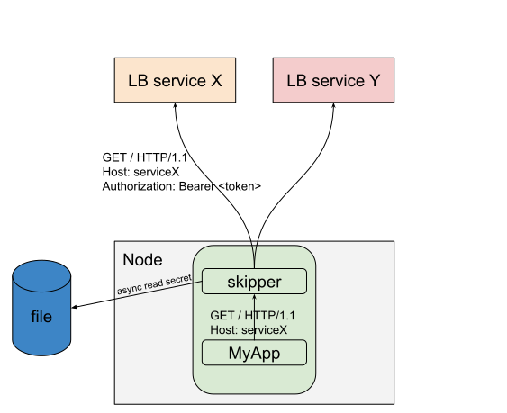

# Egress Proxy

**Disclaimer**: Egress features are probably not feature
complete. Please create [GitHub Issues](https://github.com/zalando/skipper/issues)
to show your ideas about this topic.

The picture below shows an authentication use case with Bearer token
injection, to show the egress traffic flow:


Skipper has some features, which are egress specific. Some features,
for example [dropRequestHeader](filters.md#droprequestheader) or
[ratelimit](filters.md#ratelimit), might also be used, but are not
listed here:

* circuit breaker filters
   * [consecutiveBreaker](filters.md#consecutivebreaker)
   * [rateBreaker](filters.md#ratebreaker)
   * [disableBreaker](filters.md#disablebreaker)
* [bearerinjector](filters.md#bearerinjector) filter, that injects tokens for an app
* The secrets module that does
   * automated secrets rotation read from files used by `bearerinjector filter`
   * dynamic secrets lookup used by `bearerinjector filter`
   * encryption and decryption used by [OpenID Connect filters](filters.md#oauthoidcuserinfo)

## Secrets Module

**Disclaimer**: the specified features might be changed to make use
  cases work in the future.

### Automated Secrets rotation

Secrets are read from files. Files can be rewritten by third party
tools to integrate whatever provider you want.
In Kubernetes you can write
[Secrets](https://kubernetes.io/docs/concepts/configuration/secret/)
with an API and read them using a rotated, mounted files from skipper
for example.

To specify files or directories to find secrets, you can use
`-credentials-paths` command line flag. Filenames are used to define
the name of the secret, which will be used as a lookup key.

The files need to be created before skipper is started, and as of today
skipper doesn't find new files automatically. This might change in the
future.

To change the default update interval, which defaults to `10m`, you
can use the `-credentials-update-interval` command line flag.

#### Example bearer injection

Create file `/tmp/secrets/mytoken`, that contains `mytoken`:

```
mkdir /tmp/secrets; echo mytoken >/tmp/secrets/mytoken`.
```

start fake service

```
nc -l 8080
```

start skipper proxy

```
skipper -inline-routes='Host("host1") -> bearerinjector("/tmp/secrets/mytoken") -> "http://127.0.0.1:8080/"' -credentials-paths=/tmp/secrets -credentials-update-interval=10s
..
[APP]INFO[0004] Updated secret file: /tmp/secrets/mytoken
..
```

Client calls skipper proxy

```
% curl -H"Host: host1" localhost:9090/foo
^C
```


fake service shows

```
GET /foo HTTP/1.1
Host: 127.0.0.1:8080
User-Agent: curl/7.49.0
Accept: */*
Authorization: Bearer mytoken
Accept-Encoding: gzip
```

Change the secret: `echo changedtoken >/tmp/secrets/mytoken`.
Wait until skipper logs: `[APP]INFO[0010] update secret file: /tmp/secrets/mytoken`

Restart fake service (CTRL-c to stop)

```
nc -l 8080
```

Client calls skipper proxy retry:

```
% curl -H"Host: host1" localhost:9090/foo
^C
```

fake service shows

```
GET /foo HTTP/1.1
Host: 127.0.0.1:8080
User-Agent: curl/7.49.0
Accept: */*
Authorization: Bearer changedtoken
Accept-Encoding: gzip
```

This example showed bearer injection with secrets rotation.

##### Reach multiple services
Often your service wants to reach multiple services, so you need to
differentiate these routes, somehow.

For example your service needs to access `a.example.com` and
`b.example.com`.

One example is to use `.localhost` domain, so `a.localhost` and
`b.localhost` in your application and in skipper routes you would
have:

```
a: Host("a.localhost") -> bearerinjector("/tmp/secrets/mytoken") -> "https://a.example.com"
b: Host("b.localhost") -> bearerinjector("/tmp/secrets/mytoken") -> "https://b.example.com"
```

You can also use host aliases, in Linux `/etc/hosts`, or in Kubernetes
`hostAliases`:

Pod spec:

```
spec:
  hostAliases:
  - ip: 127.0.0.1
    hostnames:
    - a.local
    - b.local
```


## Future - TODOs

We want to experiment in how to best use skipper as egress proxy.  One
idea is to implement [forward proxy via HTTP CONNECT](https://github.com/zalando/skipper/issues/929)
and being able to use the routing to inject the right Authorization headers with the
[bearerinjector filter](filters.md#bearerinjector), for example.

If you have ideas please add your thoughts in
[one of the issues](https://github.com/zalando/skipper/labels/egress),
that match your idea or create a new one.
