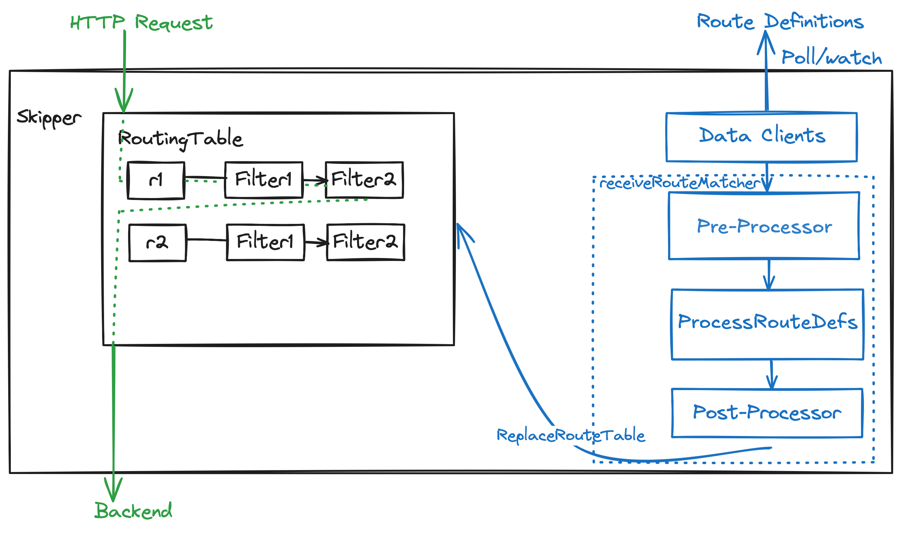

# Routing
In Skipper (the HTTP router and reverse proxy), routing refers to the process of matching incoming HTTP requests to routes 
and applying the associated filters and backend configurations.
It provides multiple **extension points** to customize how routes are processed and how HTTP requests are handled. 
These extension points allow us to modify route behavior at different stages of the routing lifecycle.



## Extension Points Overview

Skipper offers three main extension points to customizing routing behavior:

1. **PreProcessors** - Modify or inspect routes before they are instantiated (work with route definitions)
2. **Filters** - Process individual HTTP requests and responses during runtime (work with traffic)
3. **PostProcessors** - Modify or inspect routes after instantiation but before applied in active routing table (work with constructed routes)

Each extension point operates at a different stage and serves different purposes.
PreProcessors and PostProcessors are for **route-level** customization during routing table updates (i.e. in the control plane), while Filters are 
for **request-level** processing during runtime traffic handling (i.e. in the data plane).

### Route Processors (PreProcessors & PostProcessors)

They allow us to transform, validate, or prepare routes before they become active in the routing table of the proxy.


#### Processing Order

When routes are loaded, they go through the following flow:

1. **DataClient** loads raw route data from a source (file, database, etc.)
2. **PreProcessors** run (can modify or inspect `eskip.Route` definitions)
3. Routes are **instantiated** into `routing.Route` objects and **Filters** are created as defined by each route
4. **PostProcessors** run (can modify or inspect instantiated routes)
5. Routes become **active** in the routing table of the proxy
6. **Filters** process HTTP requests/responses that match these routes

This pipeline allows PreProcessors to work with lightweight route definitions, while PostProcessors can access fully 
constructed route objects with filter instances and endpoint configurations. Filters operate later, during actual request processing.

### PreProcessors

PreProcessors are interfaces that process routes **before** they are instantiated from their `eskip.Route` representation.
This allows modification or preparing prerequisites for the route definitions before they become part of the routing table.

#### Interface

Implements the following interface:

```go
type PreProcessor interface {
    Do([]*eskip.Route) []*eskip.Route
}
```

#### Built-in PreProcessors

Skipper includes several built-in PreProcessors. Here are two examples.

##### DefaultFilters PreProcessor

Prepends and/or appends filters to all routes.

**Use case:** Add common filters like logging, metrics, or authentication to all routes without
manually adding them to each route definition.

##### OPA PreProcessor

Starts Open Policy Agent instances based on route definitions that include OPA related filters.
Since OPA instances may take time to start, it handles initialization here rather than blocking route instantiation.

**Use case:** Ensure OPA instances are created and started before OPA filter creation, to avoid delays during route instantiation.


### PostProcessors

PostProcessors are interfaces that process routes **after** they are instantiated from their data representation, and
**before** they are passed to be effective in the routing table.

#### Interface

Implements this interface:

```go
type PostProcessor interface {
    Do([]*routing.Route) []*routing.Route
}
```

#### Built-in PostProcessors

Skipper includes several built-in PostProcessors. Here is an example.

##### LoadBalancer Algorithm Provider PostProcessor

Initializes the load balancing algorithm for routes with LB backends.

**Implementation:** `loadbalancer.NewAlgorithmProvider()` in `loadbalancer/algorithm.go`

**Use case:** Assigns appropriate load balancing algorithms (roundRobin, random, consistentHash, powerOfRandomNChoices, etc.)
to routes with LB backends based on their configuration.


