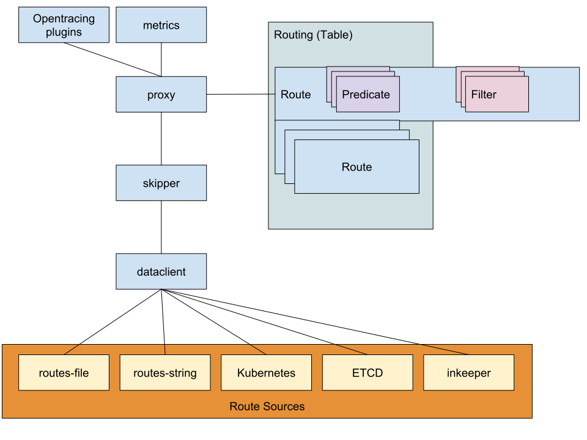
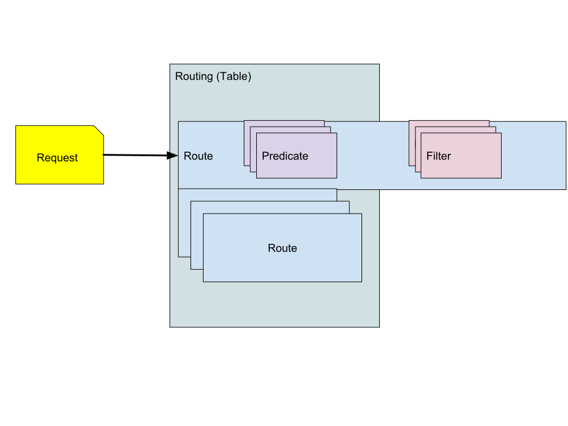
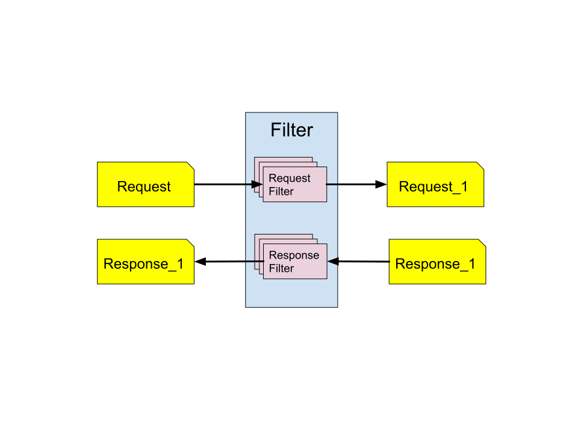
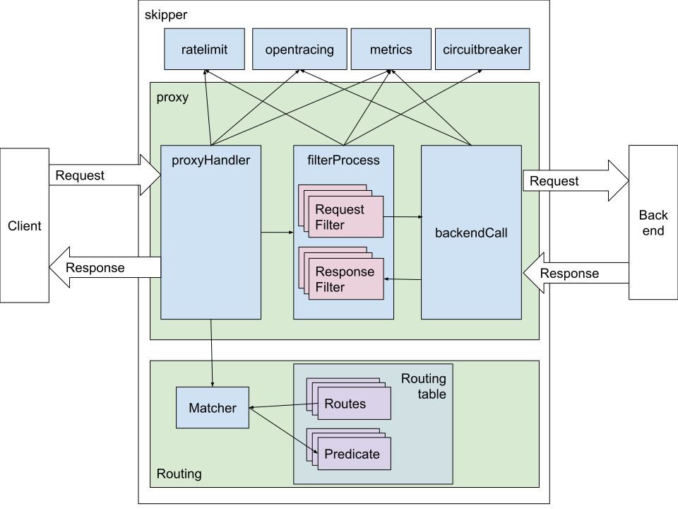

## Architecture

The core business of skipper is routing based on HTTP. It performs and
scales well, for example it handles more than 800000 routes in
production with 60000 requests per second.

Skipper is written as a library and is also a multi binary project with
2 binaries, named `skipper` and `eskip`. `Skipper` is the HTTP proxy
and `eskip` is a CLI application to verify, print, update or delete
Skipper routes.

Skipper's internal architecture is split into different packages. The
`skipper` package has connections to multiple `dataclient`, that pull
information from different sources, for example local routes from an
eskip file or dynamic routes from Kubernetes ingress objects.

The `proxy` package gets the routes populated by skipper and has
always a current routing table which will be replaced on change.

A route is one entry in the routing table. A route consists of one or
more `predicate`, that are used to find a route for a given HTTP
request. A route can also have one or more `filter`, that can modify
the content of the request or response.  A route can point to a
backend, it can be a `<shunt>`, meaning that skipper serves the requests
for the route, a `<loopback>`, meaning that the requests will be
matched against the routing table again after filters have modified
them, or a `<dynamic>`, meaning that the target backend must be set in a filter.

[Opentracing API](http://opentracing.io/) is supported via
`tracers` and you can find all of them in `./tracing/tracers/`. For
example [Jaeger](https://github.com/jaegertracing/jaeger) is supported.

Skipper has a rich set of metrics that are exposed as json, but can
also be exported in [Prometheus](https://prometheus.io) format.



## Concepts

### Route definition

A route consists of an ID, predicates, filters and a backend and is
most often written in [eskip syntax](https://pkg.go.dev/github.com/zalando/skipper/eskip).

Syntax:

```
ID:
        Predicate1() && .. && PredicateN()
        -> filter1()
        ...
        -> filterN()
        -> BACKEND
```

An example routing configuration:

```sh
baidu:
        Path("/baidu")
        -> setRequestHeader("Host", "www.baidu.com")
        -> setPath("/s")
        -> setQuery("wd", "godoc skipper")
        -> "http://www.baidu.com";
google:
        *
        -> setPath("/search")
        -> setQuery("q", "godoc skipper")
        -> "https://www.google.com";
yandex:
        * && Cookie("yandex", "true")
        -> setPath("/search/")
        -> setQuery("text", "godoc skipper")
        -> tee("http://127.0.0.1:12345/")
        -> "https://yandex.ru";
```

### Predicate

A Predicate adds a matching rule to a route.
For example the Cookie predicate, `Cookie("yandex", "true")`, matched
if there is a cookie in the request with name "yandex" and the value
is "true", else the route processing will go on and try to find
another matching route for the given request. Multiple predicates can
be combined by `&&` which means a logical **AND**. If you need a
logical **OR**, you have to create another route.

Special Predicates:

- `*` catch all is always true
- `Path()` reduces the number of routes in O(log n) time to scan afterwards a subset in linear time
- `PathSubtree()` reduces the number of routes O(log n) time to scan afterwards a subset in linear time

#### Predicate and routing table

A routing table consists of a number of routes.  A route has a list of
predicates and filters.  Predicates match an incoming request to a
specific, best matching, route.  Each route has a set of filters.




### Filter

A filter changes a HTTP request or response or both. Multiple filters
can be concatenated by `->`.

Some special filters are:

- `inlineContent()` sets the HTTP response body, should be used with status() filter and  <shunt> backend
- `static()` serves static files and should be used with <shunt> backend
- `status()` sets HTTP status code to a given value, should be used with <shunt> backend
- `tee()` clones request to given target

#### Filter in context of an HTTP request

The picture shows the transformation of the requests and responses



### Backend

The last entry of a route is the backend definition, that will be
called with the result request after filter processing. Normally this
is an URL string.

Special backends:

- `<loopback>` restart route processing with the possibly changed request
- `<shunt>` stops processing, used for fast returns
- `<dynamic>` target is set dynamically in a filter
- `<$algorithm, "be1", "be2", ..., "beN">` load balanced backend with N backends

See more about backends in [backend references](../reference/backends.md).

### Dataclient

Dataclients are used to pull route information from a data source. The
data will be used to create routes according to the dataclient. As a
special case, for example kubernetes dataclient automatically adds
HTTP->HTTPS redirects if skipper is started with `-kubernetes-https-redirect`.

Dataclients:

- [eskip file](../data-clients/eskip-file.md)
- [remote eskip](../data-clients/eskip-remote.md)
- [route string](../data-clients/route-string.md)
- [kubernetes](../data-clients/kubernetes.md)
- [etcd](../data-clients/etcd.md)

## Route processing

Package `skipper` has a Go `http.Server` and does the `ListenAndServe`
call with the `loggingHandler` wrapped `proxy`.  The `loggingHandler`
is basically a middleware for the `proxy` providing access logs and
both implement the plain Go [http.Handler interface](https://golang.org/pkg/net/http/#Handler).

For each incoming `http.Request` the `proxy` will create a request
context and enhance it with an [Opentracing API](http://opentracing.io/) Span.
It will check proxy global ratelimits first and after that lookup the
route in the routing table. After that skipper will apply all request
filters, that can modify the `http.Request`. It will then check the
route local ratelimits, the circuitbreakers and do the backend
call. If the backend call got a TCP or TLS connection error in a
loadbalanced route, skipper will do a retry to another backend of that
loadbalanced group automatically. Just before the response to the
caller, skipper will process the response filters, that can change the
`http.Response`.

In two special cases, skipper doesn't forward the request to the
backend. When the route is shunted (`<shunt>`), skipper serves the
request alone, by using only the filters. When the route is a
`<loopback>`, the request is passed to the routing table for finding
another route, based on the changes that the filters made to the
request. In case it will always find a `<loopback>` route it will stop
after maximum number of loopbacks is reached and logs an error.



### Routing mechanism

The routing executes the following steps in the typical case:

1. Select the best fitting route by matching the request against the
   predicates. When no route found, respond with 404 (unless the default
   status code is configured to a different value).

2. Execute the filters defined in the route in normal order on the
   request. The filters may or may not alter the request.

3. Forward the request to the backend defined by the route and receive
   a response.

4. Execute the filters defined in the route in reverse order on the
   response. The filters may or may not alter the response.

5. Respond to the incoming request with the resulting response.

### Route matching

Skipper can handle a relatively large number of routes with acceptable
performance, while being able to use any attribute of the incoming HTTP
requests to distinguish between them. In order to be able to do so, the
path matching predicates (`Path()` and `PathSubtree()` but not `PathRegexp()`)
have a special role during route matching, which is a tradeoff by
design, and needs to be kept in mind to understand in some cases why a
certain route was matched for a request instead of another.

The route matching logic can be summed up as follows:

1. Lookup in the path tree based on the `Path()` and the `PathSubtree()`
   predicates, using the path component of the incoming request's URI. Then
   the remaining predicates of the found route(s) are evaluated.

    * the path lookup is a radix tree with O(log(n)) time complexity

    * in case of intersecting paths, the more specific path is matched in
     the tree

    * `PathRegexp()` is not used in the tree, but it is evaluated only after
     `Path()` or `PathSubtree()`, just like e.g. `Method()` or `Host()`.

2. _If_ step #1 matches multiple routes, which means there are multiple
   routes in the same position of the path tree, and all other predicates
   match the request, too, then the route with the highest
   [weight](../reference/predicates.md#weight) is matched.

    * this is an O(n) lookup, but only on the same leaf

    * the root of the tree is considered a single leaf, so if not using the
      `Path()` or `PathSubtree()` predicates, the entire lookup will become O(n)
      over all the routes.

3. _If_ #2 results in multiple matching routes, then one route will be
   selected. It is unspecified which one.

See more details about the predicates here: [Predicates](../reference/predicates.md).

### Route creation

Skipper has two kind of routes:

1. [eskip.Route](https://pkg.go.dev/github.com/zalando/skipper/eskip#Route)
2. [routing.Route](https://pkg.go.dev/github.com/zalando/skipper/routing#Route)

An `eskip.Route` is the parsed representation of user input. This will
be converted to a `routing.Route`, when the routing table is built. A
tree of `routing.Route` will be used to match an incoming Request to a route.

Route creation steps:

1. Skipper's route creation starts with the [Dataclient](https://pkg.go.dev/github.com/zalando/skipper/routing#DataClient)
   to fetch routes (`[]*eskip.Route`).
2. These will be first processed by
   `[]routing.PreProcessor`. [PreProcessors](https://pkg.go.dev/github.com/zalando/skipper/routing#PreProcessor) are able to add, remove,
   modify all `[]*eskip.Route`.
3. After that `[]*eskip.Route` are converted to `[]*routing.Route`.
4. `[]routing.PostProcessor` are executed. [PostProcessors](https://pkg.go.dev/github.com/zalando/skipper/routing#PostProcessor) are a ble to
   add, remove, modify all `[]*routing.Route`.
5. Last the active routing table is swapped. Now all incoming requests
   are handled by the new routing table


## Building skipper

### Local build

To get a local build of skipper for your CPU architecture, you can run
`make skipper`. To cross compile to non Linux platforms you can use:

- `make build.darwin` for Mac OS X (amd64)
- `make build.windows` for Windows (amd64)

The local build will write into `./bin/` directory.

### CI build

The current used CI flow to build the official docker container, you
can see in [delivery.yaml](https://github.com/zalando/skipper/blob/master/delivery.yaml).
Official release versions you will find at
`registry.opensource.zalan.do/teapot/skipper:${RELEASE_VERSION}`,
where `${RELEASE_VERSION}` is the git tag got by `$(git describe --tags --always --dirty)`.

Test versions are released at
`registry.opensource.zalan.do/teapot/skipper-test:${CDP_BUILD_VERSION}`
for every pull request, limited to only repository members, because of
compliance and security reasons.

## Testing routes

To test routes you can use a local build of skipper and pass arguments
`-inline-routes=<route string>` or for more complex ones
use a local `eskip` file on disk and use `-routes-file=<filepath>`.

Example:

```sh
./bin/skipper -address :9999 -inline-routes 'r: * -> setQuery("lang", "pt") -> "http://127.0.0.1:8080/"'
```

Now you have a proxy running that will set a query to your request URL
and call `http://127.0.0.1:8080/?lang=pt`

The simplest way of testing a proxy is using a local backend and a
local browser.

Local backend example:

```sh
./bin/skipper -address :8080 -inline-routes 'r: * -> inlineContent("Hello world!") -> status(200) -> <shunt>'
```

If you want to do the request and see the response in detail, you can
use `curl` as a browser, which should be installed on most Linux and
Mac OS X computers.

Example client call to our defined proxy:

```sh
% curl localhost:8080 -v
* Rebuilt URL to: localhost:8080/
*   Trying ::1...
* Connected to localhost (::1) port 8080 (#0)
> GET / HTTP/1.1
> Host: localhost:8080
> User-Agent: curl/7.49.0
> Accept: */*
>
< HTTP/1.1 200 OK
< Content-Length: 12
< Content-Type: text/plain; charset=utf-8
< Server: Skipper
< Date: Thu, 01 Nov 2018 15:54:13 GMT
<
* Connection #0 to host localhost left intact
Hello world!
```

## YAML Configuration

The usage of flags to configure the `skipper` binary can get quickly out
of hand. You can use a `yaml` file instead to populate the flags presented
in the `skipper -help` command.

```yaml
kubernetes: true
kubernetes-in-cluster: true
kubernetes-https-redirect: true
proxy-preserve-host: true
serve-host-metrics: true
address: ":8080"
enable-ratelimits: true
experimental-upgrade: true
metrics-exp-decay-sample: true
metrics-flavour: ["codahale","prometheus"]
enable-connection-metrics: true
whitelisted-healthcheck-cidr: "172.20.0.0/16"
ignore-trailing-slash: true
inline-routes: 'r: * -> inlineContent("Hello world!") -> status(200) -> <shunt>'
```

Considering that this file would be named `config.yaml` you can use it to populate
the flags using the `config-file` flag:

```sh
./bin/skipper -config-file=config.yaml
```

Performing the same call to the address as exemplified in the previous section should
yield the same results.

## Current routing table

To investigate the current routing table skipper has loaded into its
memory, you can use the `-support-listener`, which defaults to port
9911 and you have to do a GET request to the `/routes` endpoint.

Example:

```sh
% curl localhost:9911/routes
r: *
  -> setQuery("lang", "pt")
  -> "http://127.0.0.1:8000";
```

If you do not see your route, then you have most probably a syntax
error in your route definition, such that the route was not loaded
into memory.

To print the number of routes, `X-Count` header, and the last update
timestamp, `X-Timestamp` header, you can use a HEAD request to the
support listener `/routes` endpoint:

```bash
% curl -I localhost:9911/routes
HTTP/1.1 200 OK
Content-Type: text/plain
X-Count: 1
X-Timestamp: 1541086036
Date: Fri, 02 Nov 2018 00:30:43 GMT
```

For skipper operators the number of routes can be interesting for
statistics and the timestamp to detect skipper instances that have not
updated its routing table.

If there is more than 1024 routes used, then the paging the results is
possible with the `offset` and `limit` query parameters:

```
curl localhost:9911/routes?offset=2048&limit=512
```

### Route IDs

In the following example **rid** is the route ID:

```sh
% curl localhost:9911/routes
rid: *
  -> setQuery("lang", "pt")
  -> "http://127.0.0.1:8000";
```

If the route ID has a prefix `kube_`, then it is a route created by
the Kubernetes dataclient. We do not disallow that you create manually
routes with `kube_` prefix, but most of the time you should not use it
in other routes to differentiate the routes created by other
dataclients, in case you use multiple at the same time.
