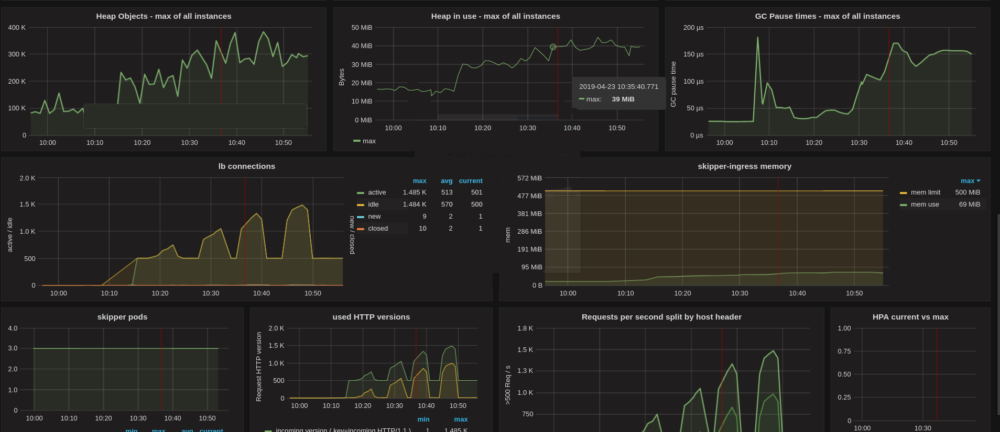

## Kubernetes

In the beginning we chose to run Skipper as
[daemonset](https://kubernetes.io/docs/concepts/workloads/controllers/daemonset/)
to run it on all worker nodes. Since 2018 we run Skipper as deployment
with an [hpa, horizontal Pod autoscaler,](https://kubernetes.io/docs/tasks/run-application/horizontal-pod-autoscale/)
to scale Skipper by CPU usage.
All our clusters are using AWS autoscaling groups (ASG), to increase
and decrease the number of running nodes in a cluster based on use.

In both deployment styles we run Skipper with `hostnetwork: true` and
point the loadbalancer in front of it to the skipper port of all
worker nodes. In our case we run an AWS Application loadbalancer (ALB)
in front, and we terminate TLS on the ALB. A health check from the ALB
detects, if Skipper is running on a worker node or not.

### First steps

The next part will show you how to run Skipper with a minimal feature
set, that supports already most of the features.

A minimal set of arguments that should be chosen to support most
Kubernetes use cases:

```
          - "skipper"
          - "-kubernetes"
          - "-kubernetes-in-cluster"
          - "-kubernetes-path-mode=path-prefix"
          - "-address=:9999"
          - "-wait-first-route-load"
          - "-proxy-preserve-host"
          - "-enable-ratelimits"
          - "-experimental-upgrade"
          - "-metrics-flavour=prometheus"
          - "-metrics-exp-decay-sample"
          - "-serve-host-metrics"
          - "-disable-metrics-compat"
          - "-enable-connection-metrics"
          - "-histogram-metric-buckets=.0001,.00025,.0005,.00075,.001,.0025,.005,.0075,.01,.025,.05,.075,.1,.2,.3,.4,.5,.75,1,2,3,4,5,7,10,15,20,30,60,120,300,600"
          - "-max-audit-body=0"
          - "-idle-timeout-server=62s"
```

Skipper started with these options will support instance based
ratelimits, a wide range of Prometheus metrics, websockets and a
better HTTP path routing than the default Kubernetes Ingress spec
supports.

The former Kubernetes Ingress v1beta1 spec defined a path
as regular expression, which is not what most people would expect, nor
want. Skipper defaults in Kubernetes to use the [PathRegexp predicate](../reference/predicates.md#pathregexp)
for routing, because of the spec. We believe the better default is the
path prefix mode, that uses [PathSubtree predicate](../reference/predicates.md#pathsubtree),
instead. Path prefix search is much more scalable and cannot lead to
unexpected results by not so experienced regular expressions users.
Since Kubernetes v1.18, [Ingress v1 path definition](https://kubernetes.io/docs/reference/generated/kubernetes-api/v1.22/#httpingresspath-v1-networking-k8s-io)
supports all path matching modes that are common in skipper:

- `pathType: Exact` maps to [`Path()`](../reference/predicates.md#path)
- `pathType: Prefix` maps to [`PathSubtree()`](../reference/predicates.md#pathsubtree)
- `pathType: ImplementationSpecific` is defined as you set path prefix mode.

To find more information about Metrics, including formats and example
Prometheus queries you find in the [metrics
section](../operation/operation.md#monitoring).
The settings shown above support system and application metrics to
carefully monitor Skipper and your backend applications. Backend
application metrics get error rates and latency buckets based on host
headers. The chosen options are a good setup to safely run all
workloads from small to high traffic.

The option `-max-audit-body=0`, won't log the HTTP body, if you would
do audit logging, to have a safe default.

The last option `-idle-timeout-server=62s` was chosen, because of a
[known issue](https://github.com/zalando/skipper/issues/964), if you
run in a multi layer loadbalancer, with ALBs in front of Skipper.
[ALBs idle connection timeout is 60s](https://docs.aws.amazon.com/elasticloadbalancing/latest/application/application-load-balancers.html#connection-idle-timeout)
and AWS support told us to run the backends with a bigger timeout,
than the ALB in front.

### Opt-In more features

#### Reverse Source Predicate

Depending on the HTTP loadbalancer in front of your Skippers, you might
want to set `-reverse-source-predicate`. This setting reverses the
lookup of the client IP to find it in the `X-Forwarded-For` header
values. If you do not care about
[clientRatelimits](../reference/filters.md#clientratelimit)
based on X-Forwarded-For headers, you can also ignore this.

#### Cluster Ratelimit

Ratelimits can be calculated for the whole cluster instead of having
only the instance based ratelimits. The common term we use in skipper
documentation is [cluster ratelimit](ratelimit.md#cluster-ratelimit).
There are two option, but we highly recommend the use of Redis based
cluster ratelimits. To support redis based cluster ratelimits you have to
use `-enable-swarm` and add a list of URLs to redis
`-swarm-redis-urls=skipper-ingress-redis-0.skipper-ingress-redis.kube-system.svc.cluster.local:6379,skipper-ingress-redis-1.skipper-ingress-redis.kube-system.svc.cluster.local:6379`. We
run [redis as
statefulset](https://github.com/zalando-incubator/kubernetes-on-aws/blob/beta/cluster/manifests/skipper/skipper-redis.yaml)
with a [headless
service](https://github.com/zalando-incubator/kubernetes-on-aws/blob/beta/cluster/manifests/skipper/skipper-redis-service.yaml)
to have predictable names. We chose to not use a persistent volume,
because storing the data in memory is good enough for this use case.

#### East West

!!! attention
    This feature is deprecated. Consider using [EastWest
    Range](#east-west-range).

Skipper supports cluster internal service-to-service communication as
part of running as an [API Gateway with an East-West
setup](../kubernetes/ingress-controller.md#run-as-api-gateway-with-east-west-setup).
You have to add `-enable-kubernetes-east-west` and optionally choose a
domain
`-kubernetes-east-west-domain=.ingress.cluster.local`. Be warned: There is a
[known bug](https://github.com/zalando/skipper/issues/1024), if you
combine it with custom routes. You might want to consider [EastWest
Range](#east-west-range).

#### East West Range

Alternatively, you can use Kubernetes East West Range feature. Use the
flag `-kubernetes-east-west-range-domains` to define the cluster
internal domains `-kubernetes-east-west-range-predicates` to define the
[predicates](../reference/predicates.md) that will be appended to every
route identified as an internal domain. Differently from the
`-enable-kubernetes-east-west` and the
`-kubernetes-east-west-domain=.ingress.cluster.local` flags (check
[East West](#east-west)) this feature
will not automatically create routes for you and both features shouldn't
be used in combination. The ingress and/or route groups resources must
opt-in for east west range routes, explicitly defining them. For example,
given that Skipper was initialized with the following east-west range flags:

```
skipper \
  -kubernetes-east-west-range-domains="ingress.cluster.local" \
  -kubernetes-east-west-range-predicates='ClientIP("10.2.0.0/16")'
```

and the following ingress is defined:

```yaml
apiVersion: networking.k8s.io/v1
kind: Ingress
metadata:
  name: qux
  namespace: foo
spec:
  rules:
  - host: example.ingress.cluster.local
    http:
      paths:
      - path: "/"
        pathType: Prefix
        backend:
          service:
            name: qux
            port:
              name: baz
```

Skipper will secure this route adding the predicate `ClientIP("10.2.0.0/16")`.

The same ingress might be used for internal and external hostnames. For
example, given a slightly modified version of the ingress:

```yaml
apiVersion: networking.k8s.io/v1
kind: Ingress
metadata:
...
spec:
  rules:
  - host: example.ingress.cluster.local
    http: ...
  - host: example.mydomain.org
    http: ...
```

will make the service accessible through `example.ingress.cluster.local`
and `example.mydomain.org`, but the first hostname will only accept
connections from the network `10.2.0.0/16`, on this specific scenario.

You can specify multiple east-west range domains and predicates:

```sh
skippper \
  -kubernetes-east-west-range-domains="ingress.cluster.local,another.cluster.local"
  -kubernetes-east-west-range-predicates='ClientIP("10.2.0.0/16") && SourceLastFrom("10.2.0.0/16")'
```

#### API monitoring and Auth

As part of API Gateway features, skipper supports [API
monitoring](../reference/filters.md#apiusagemonitoring)
and common [authentication and authorization](auth.md)
protocols in Microservices architectures.

#### OpenTracing

Skipper has support for different [OpenTracing API](http://opentracing.io/) vendors, including
[jaeger](https://www.jaegertracing.io/),
[lightstep](https://lightstep.com/) and
[instana](https://www.instana.com/supported-technologies/opentracing/).
For example to configure the lightstep opentracing plugin, with a
searchable `component` and `cluster` `tag` you can use:
`- "-opentracing=lightstep component-name=skipper-ingress token=$(LIGHTSTEP_TOKEN) collector=tracing-collector.endpoint:8444 cmd-line=skipper-ingress max-buffered-spans=4096 tag=cluster=mycluster"`.
The `LIGHTSTEP_TOKEN` is passed as environment variable to
the process.

#### Global default filters

Skipper can also add [global default filters](../operation/operation.md#global-default-filters),
which will be automatically added to all routes. For example you can
use `-default-filters-prepend="enableAccessLog(4,5)"` to enable only
access logs in case of HTTP codes 4xx or 5xx. In the specific case of
`*AccessLog` filters and `-default-filters-prepend`, the default
choice can be overridden by users via `zalando.org/skipper-filter`
ingress annotation.

### Production example

A full production deployment example you find at [Zalando's configuration
repository](https://github.com/zalando-incubator/kubernetes-on-aws/tree/beta/cluster/manifests/skipper).

### Recommendations

We recommend to run a loadbalancer in front of Skipper to terminate
TLS, such that cluster users cannot access your keys and
certificates. While skipper supports SNI, hardware and cloud
loadbalancers often have hardware support to terminate TLS. It's
cheaper for you to offload TLS to these devices and trust your compute
vendor.

We recommend to start [simple](#first-steps) and grow the feature set from there.
Check features, that are used in `>60` production clusters in [Zalando's configuration
repository](https://github.com/zalando-incubator/kubernetes-on-aws/tree/beta/cluster/manifests/skipper).

#### Dashboards

As an operator, build a Skipper dashboard and learn how Skipper and
the Go runtime behaves with your workload. We successfully ran several
load tests from 0 to 25k requests per seconds.  The load test was
ramping up in less than a minute with initially 3 Skipper Pods, with an
HPA that has CPU target value of 100%.

Operations dashboard:



Application metrics dashboard:

