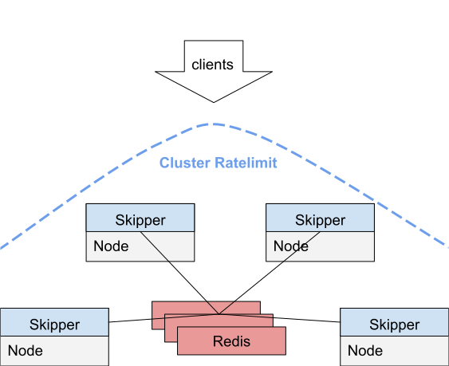
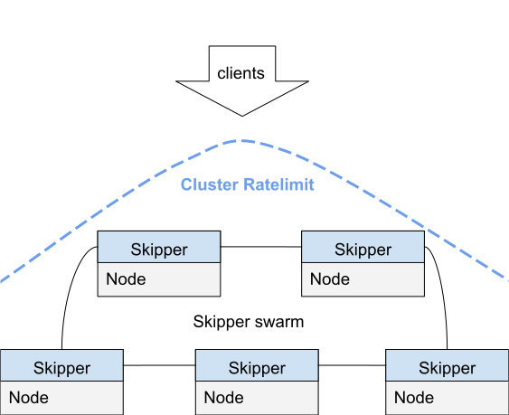

## Overview

Ratelimits are calculated for a number of requests and a
`time.Duration` for a given bucket. To enable rate limits you need to
run skipper with `-enable-ratelimits`.

A `time.Duration` is specified as string and can for example be "10s"
for ten seconds, "5m" for five minutes or "2h" for two hours.

As bucket skipper can use either the backend or some client
information.

In case of a backend ratelimit the bucket is only one global for one
route.

In case of a client ratelimit the buckets are created by the
used `ratelimit.Lookuper`, which defaults to the `X-Forwarded-For`
header, but can be also the `Authorization` header. So for the client
ratelimit with `X-Forwarded-For` header, the client IP that the first
proxy in the list sees will be used to lookup the bucket to count
requests.

## Instance local Ratelimit

Filters `ratelimit()` and `clientRatelimit()` calculate the ratelimit
in a local view having no information about other skipper instances.

### Backend Ratelimit

The backend ratelimit filter is `ratelimit()` and it is the simplest
one. You can define how many requests a route allows for a given
`time.Duration` to send to all backends of the route. This means that you
can not limit traffic to a single backend instance.

For example to limit the route to 10 requests per minute for each
skipper instance, you can specify:

```
ratelimit(10, "1m")
```

### Client Ratelimit

The client ratelimit filter is `clientRatelimit()` and it uses
information from the request to find the bucket which will get the
increased request count.

For example to limit the route to 10 requests per minute for each
skipper instance for the same client selected by the X-Forwarded-For
header, you can specify:

```
clientRatelimit(10, "1m")
```

There is an optional third argument that selects the same client by HTTP
header value. As an example for Authorization Header you would use:

```
clientRatelimit(10, "1m", "Authorization")
```

The optional third argument can create an AND combined Header
ratelimit. The header names must be separated by `,`. For example all of the
specified headers have to be the same to recognize them as the same
client:

```
clientRatelimit(10, "1m", "X-Forwarded-For,Authorization,X-Foo")
```

Internally skipper has a clean interval to clean up old buckets to reduce
the memory footprint in the long run.

#### Security Consideration

ClientRatelimit works on data provided by the client. In theory an
attacker likely can workaround all of your configurations. On the
other hand there is always a pattern in attacks, and you are more
likely being able to find the pattern and mitigate the attack, if you
have a powerful tool like the provided `clientRatelimit`.

## Cluster Ratelimit

A cluster ratelimit computes all requests for all skipper peers. This
requires, that you run skipper with `-enable-swarm` and select one of
the two implementations:

- [Redis](https://redis.io)
- [SWIM](https://www.cs.cornell.edu/projects/Quicksilver/public_pdfs/SWIM.pdf)

Make sure all requirements, that are dependent on the implementation
and your dataclient in use.

### Redis based Cluster Ratelimits

This solution is independent of the dataclient being used.
You have to run one or more [Redis](https://redis.io) instances.
See also [Running with Redis based Cluster Ratelimits](../kubernetes/ingress-controller.md#redis-based).

There are 3 different configurations to assign Redis instances as a Skipper Redis swarm.

#### Static

Specify `-swarm-redis-urls`, multiple instances can be separated by comma,
for example: `-swarm-redis-urls=redis1:6379,redis2:6379`.
Use this if you don't need to scale your Redis instances.

#### Kubernetes Service Selector

Specify `-kubernetes-redis-service-namespace=<namespace>`, `-kubernetes-redis-service-name=<name>`
and optional `-kubernetes-redis-service-port=<port number>`.

Skipper will update Redis addresses every 10 seconds from specified service endpoints.
This allows you to dynamically scale Redis instances.
Note that when `-kubernetes` is set Skipper also fetches `Ingresses` and `RouteGroups` for routing,
see [ingress-controller deployment docs](../kubernetes/ingress-controller.md).

#### HTTP Endpoint

Specify `-swarm-redis-remote=http://127.0.0.1/redis/endpoints`,

Skipper will update Redis addresses every 10 seconds from this remote URL
that should return data in the following JSON format:
```json
{
    "endpoints": [
        {"address": "10.2.0.1:6379"}, {"address": "10.2.0.2:6379"},
        {"address": "10.2.0.3:6379"}, {"address": "10.2.0.4:6379"},
        {"address": "10.2.0.5:6379"}
    ]
}
```

If you have [routesrv proxy](https://opensource.zalando.com/skipper/kubernetes/ingress-controller/#routesrv) enabled,
you need to configure Skipper with the flag `-swarm-redis-remote=http://<routesrv-service-name>.<routesrv-namespace>.svc.cluster.local/swarm/redis/shards`.
`Routesrv` will be responsible for collecting Redis endpoints and Skipper will poll them from it.

#### Implementation

The implementation use [Redis ring](https://godoc.org/github.com/go-redis/redis#Ring)
to be able to shard via client hashing and spread the load across
multiple Redis instances to be able to scale out the shared storage.

The ratelimit algorithm is a sliding window and makes use of the
following Redis commands:

- [ZREMRANGEBYSCORE](https://redis.io/commands/zremrangebyscore),
- [ZCARD](https://redis.io/commands/zcard),
- [ZADD](https://redis.io/commands/zadd) and
- [ZRANGEBYSCORE](https://redis.io/commands/zrangebyscore)



### SWIM based Cluster Ratelimits

[SWIM](https://www.cs.cornell.edu/projects/Quicksilver/public_pdfs/SWIM.pdf)
is a "Scalable Weakly-consistent Infection-style Process Group
Membership Protocol", which is very interesting to use for cluster
ratelimits. The implementation has some weaknesses in the algorithm,
that lead sometimes to too much ratelimits or too few and therefore is
not considered to be stable. For running skipper in Kubernetes with
this, see also [Running with SWIM based Cluster Ratelimits](../kubernetes/ingress-controller.md#swim-based)

In case of Kubernetes you might specify additionally
`-swarm-label-selector-key`, which defaults to "application" and
`-swarm-label-selector-value`, which defaults to "skipper-ingress" and
`-swarm-namespace`, which defaults to "kube-system".

The following shows the setup of a SWIM based cluster ratelimit:



### Backend Ratelimit

The backend ratelimit filter is `clusterRatelimit()`. You can define
how many requests a route allows for a given `time.Duration` in total
for all skipper instances summed up. The first parameter is the group
parameter, which can be used to select the same ratelimit group across
one or more routes

For example rate limit "groupA" limits the rate limit group to 10
requests per minute in total for the cluster, you can specify:

```
clusterRatelimit("groupA", 10, "1m")
```

### Client Ratelimit

The client ratelimit filter is `clusterClientRatelimit()` and it uses
information from the request to find the bucket which will get the
increased request count.  You can define how many requests a client is
allowed to hit this route for a given `time.Duration` in total for all
skipper instances summed up. The first parameter is the group
parameter, which can be used to select the same ratelimit group across
one or more routes

For example rate limit "groupB" limits the rate limit group to 10
requests per minute for the full skipper swarm for the same client
selected by the X-Forwarded-For header, you can specify:

```
clusterClientRatelimit("groupB", 10, "1m")
```

The same for Authorization Header you would use:

```
clusterClientRatelimit("groupC", 10, "1m", "Authorization")
```

The optional fourth argument can create an AND combined Header
ratelimit. The header names must be separated by `,`. For example all
of the specified headers have to be the same to recognize them as the
same client:

```
clusterClientRatelimit("groupC", 5, "10s", "X-Forwarded-For,Authorization,X-Foo")
```

Internally skipper has a clean interval to clean up old buckets to reduce
the memory footprint in the long run.

#### Security Consideration

ClusterClientRatelimit works on data provided by the client. In theory an
attacker likely can workaround all of your configurations. On the
other hand there is always a pattern in attacks, and you are more
likely being able to find the pattern and mitigate the attack, if you
have a powerful tool like the provided `clusterClientRatelimit`.

## Rate Limit Bypass

All rate limit filters support optional bypass functionality that allows certain requests to skip rate limiting entirely. This is useful for:

- Admin requests that need guaranteed access
- Health checks and monitoring that shouldn't be rate limited
- Trusted internal services
- Emergency access scenarios
- Load testing where you need to bypass rate limits to test actual backend capacity

The bypass functionality supports three methods:

1. **JWT Token-based bypass**: Requests with valid JWT tokens in a specified header or cookie
2. **IP Whitelist bypass**: Requests from whitelisted IP addresses or CIDR ranges
3. **Cookie-based bypass**: Requests with valid JWT tokens in a specified cookie (alternative to headers)

### Bypass Parameters

All rate limit filters (`ratelimit`, `clientRatelimit`, `clusterRatelimit`, `clusterClientRatelimit`) accept optional bypass parameters:

1. **bypassHeader** (string): HTTP header name containing the bypass token (e.g., "X-RateLimit-Bypass")
2. **secretKey** (string): Secret key for JWT token validation (should be kept secure)
3. **tokenExpiry** (duration): How long bypass tokens remain valid (e.g., "5m", "1h")
4. **ipWhitelist** (string, optional): Comma-separated list of IP addresses or CIDR ranges

### Service Rate Limit with Bypass

```
ratelimit(10, "1m", 429, "X-Bypass-Token", "secret-key", "5m")
```

This allows 10 requests per minute, but requests with a valid JWT token in the `X-Bypass-Token` header will bypass the limit.

With IP whitelist:
```
ratelimit(10, "1m", 429, "X-Bypass-Token", "secret-key", "5m", "127.0.0.1,192.168.1.0/24")
```

### Client Rate Limit with Bypass

```
clientRatelimit(10, "1m", "X-Bypass-Token", "secret-key", "5m")
```

With custom lookuper and bypass:
```
clientRatelimit(10, "1m", "Authorization", "X-Bypass-Token", "secret-key", "5m")
```

### Cluster Rate Limit with Bypass

```
clusterRatelimit("groupA", 100, "1m", 429, "X-Bypass-Token", "secret-key", "10m")
```

```
clusterClientRatelimit("groupB", 20, "1h", "Authorization", "X-Bypass-Token", "secret-key", "5m")
```

### JWT Token Generation

Bypass tokens are JWT tokens signed with HMAC-SHA256. You can generate tokens using the `ratelimitBypassGenerateToken()` filter or create them programmatically using the `filters/ratelimit/bypass` package.

Example route for token generation:
```
admin_token: Path("/admin/bypass-token")
  -> ratelimitBypassGenerateToken()
  -> <shunt>;
```

### Token Validation

You can validate tokens using the `ratelimitBypassValidateToken()` filter:

```
validate: Path("/admin/validate-token")
  -> ratelimitBypassValidateToken()
  -> <shunt>;
```

### Load Testing Usage

The bypass functionality is particularly valuable for load testing scenarios where you need to test the actual capacity of your backend services without being limited by rate limiting policies.

Example load testing setup:
```
# Production route with rate limiting
api: Path("/api")
  -> clientRatelimit(100, "1m", "X-Load-Test-Token", "load-test-secret", "1h")
  -> "https://api.backend.net";

# Token generation endpoint for load testing
load_test_token: Path("/internal/load-test-token")
  -> ratelimitBypassGenerateToken()
  -> <shunt>;
```

Load testing tools can:
1. Obtain a bypass token from `/internal/load-test-token`
2. Include the token in the `X-Load-Test-Token` header
3. Execute load tests without rate limit interference
4. Measure true backend capacity and performance

### Global Bypass Configuration

Instead of configuring bypass parameters individually for each rate limit filter, you can set global bypass configuration via command line arguments when starting Skipper. This approach is especially useful for consistent bypass behavior across all rate limits in your deployment.

#### Global Configuration Flags

- `--ratelimit-bypass-secret-key` - Global secret key for JWT token validation
- `--ratelimit-bypass-token-expiry` - Global token expiry duration (e.g., "5m", "1h", "24h")
- `--ratelimit-bypass-header` - Global HTTP header name for bypass tokens (default: "X-RateLimit-Bypass")
- `--ratelimit-bypass-cookie` - Global HTTP cookie name for bypass tokens
- `--ratelimit-bypass-ip-whitelist` - Global comma-separated list of IP addresses or CIDR ranges

#### Example Global Configuration

```bash
skipper \
  --ratelimit-bypass-secret-key="your-global-secret-key" \
  --ratelimit-bypass-token-expiry="1h" \
  --ratelimit-bypass-header="X-Bypass-Token" \
  --ratelimit-bypass-cookie="bypass-token" \
  --ratelimit-bypass-ip-whitelist="127.0.0.1,192.168.0.0/16,10.0.0.0/8" \
  --enable-ratelimits \
  --routes-file=routes.eskip
```

#### Usage with Global Configuration

When global bypass configuration is set, all rate limit filters automatically inherit these settings:

```
# These filters will use global bypass configuration
api_v1: Path("/api/v1")
  -> clientRatelimit(100, "1m")
  -> "https://api.backend.net";

api_v2: Path("/api/v2")
  -> clusterRatelimit("api-group", 500, "1h")
  -> "https://api.backend.net";
```

You can still override global settings by providing local bypass parameters:

```
# This filter overrides global configuration
special_api: Path("/special")
  -> clientRatelimit(10, "1m", "X-Special-Bypass", "special-secret", "30m")
  -> "https://special.backend.net";
```

#### Precedence

Local bypass configuration always takes precedence over global configuration:
1. **Local bypass parameters** - Highest priority (specified in individual filter arguments)
2. **Global bypass configuration** - Used when no local bypass parameters are provided
3. **No bypass** - Default behavior when neither local nor global bypass is configured

#### Token Location Precedence

When both bypass header and bypass cookie are configured, the token is searched in this order:
1. **HTTP Header** - Checked first (if configured)
2. **HTTP Cookie** - Checked if no token found in header (if configured)

This allows for flexible deployment scenarios where different clients can use different authentication methods.

### Security Considerations

- **Keep secret keys secure**: Store bypass secret keys in environment variables or secure configuration
- **Use appropriate token expiry**: Balance security with usability - shorter expiry is more secure
- **Limit IP whitelist scope**: Only whitelist trusted networks and specific IP addresses
- **Monitor bypass usage**: Log and monitor when bypass functionality is used
- **Rotate secret keys regularly**: Implement key rotation for long-running deployments
- **Secure load test endpoints**: Ensure token generation endpoints are only accessible from trusted networks
- **Use different secrets for different environments**: Don't reuse production bypass secrets in test environments

The bypass functionality adds minimal overhead when not used, and bypass validation is fast and efficient.
